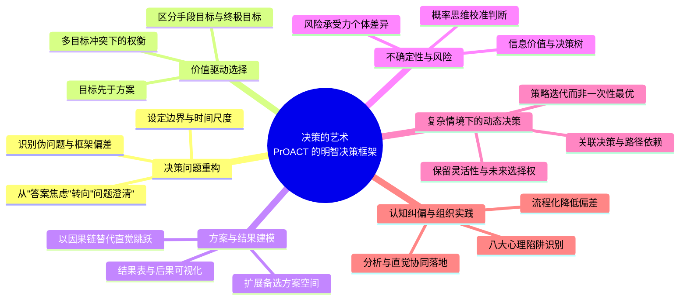

# 《决策的艺术：做出明智决策的实用指南》读书总结

## 1. 全书逻辑架构



---

## 2. 逐章深度分析

## 引言 决策的智慧

### 引言 决策的智慧

**论证线索**  
作者先指出多数人把决策理解为"选项中二选一"，从而忽略了问题定义、目标澄清与后果评估。随后提出：高质量决策不是靠天赋，而是可训练的方法。最后用全书路线图说明，PrOACT 不是数学技巧堆砌，而是一套从思考起点到执行落地的完整认知流程。

**核心议题**  
明智决策的本质，是把复杂选择转化为可分解、可比较、可复盘的结构化过程。

**关键概念**

- **决策质量**：不是只看结果好坏，而是看在当时信息条件下，过程是否合理、透明、可检验。
- **过程优先**：关注是否做对了思考步骤，而不被短期结果偶然性误导。
- **PrOACT**：问题（Problem）、目标（Objectives）、备选方案（Alternatives）、结果（Consequences）、取舍（Trade-offs），并辅以不确定性、风险承受力与关联决策。

**关键证据/案例**

- 现象层（对应 PrOACT 的 `Problem`/边界校准）：先定义系统边界（真正的问题，边界，框架）。现实中重大失误往往并非"不会算"，而是"问错问题"，"比错对象"或"过早收敛方案"。
- 机制层（对应 PrOACT 的 `Objectives`/`Alternatives`/`Trade-offs`）：把决策拆分为可比的要素与权衡维度后，才能逐项检查盲点，减少凭情绪或惯性拍板。
- 推论层（对应 PrOACT 的 `Consequences`/不确定性/风险承受力）：用结果表与概率结构把后果讲清楚，再把风险偏好纳入比较，形成可复盘、可沟通的最终判断。

下面这张图把三层划分与 PrOACT 流程对齐（用于解释“为什么会错、错在何处、靠什么纠正”）：

```mermaid
flowchart LR
  A[现象层：问错问题/过早收敛] --> B[PrOACT: Problem(问题)+边界/框架校准]
  C[机制层：拆解目标与方案并权衡] --> D[PrOACT: Objectives(目标)+Alternatives(备选)+Trade-offs(取舍)]
  E[推论层：基于后果比较并纳入概率/风险] --> F[PrOACT: Consequences(结果)+Uncertainty(概率/信息)+Risk(风险承受力)+决策输出]
```

**底层思维模型**  
这是典型的"系统拆解模型"：先定义系统边界，再处理要素间关系。它与后文第 10 章心理陷阱形成互补：流程是防错骨架，纠偏是防错护栏。

**复盘思考**  
你最近一次"结果不错但过程混乱"的决策，若按 PrOACT 回看，最先暴露的问题会在哪一步？

## 第一部分 决策基础

第一部分的作用是把"会做选择"升级为"会做决策"。其逻辑推进是：先解释为什么经验和直觉不足以应对复杂选择，再指出大多数错误始于问题定义阶段，最后建立一个统一语言，让后续章节都在同一框架内展开。第 1 章负责建立方法意识，第 2 章负责校准问题边界，两章关系是"先立方法，再定起点"。

### 1. 做出明智的决策：为何我们需要一种方法

**论证线索**  
本章先展示现实决策中常见失败模式，再归纳其共同根源是非结构化思考。随后引入 PrOACT 作为通用流程，强调它不是替代判断，而是提升判断质量。作为第一部分起点，本章为第 2 章的问题定义打地基：没有方法意识，就无法识别问题偏差。

**核心议题**  
复杂决策需要方法论，不是因为人不聪明，而是因为直觉在高复杂度情境下系统性失灵。

**关键概念**

- **决策陷阱**：在时间压力、信息不全、情绪驱动下反复出现的认知与流程错误。
- **结构化决策**：将模糊选择分解为可分析模块并逐步验证。
- **方法迁移性**：同一框架可跨场景使用（职业、投资、管理、家庭）。

**关键证据/案例**

- 第一步（现象）：人们常在"熟悉情境"中过度依赖经验，忽视新变量。
- 第二步（机制）：方法缺失导致无法比较方案，只能比较感觉。
- 第三步（框架）：PrOACT 将主观判断前置为显性步骤，降低遗漏关键要素的概率。

**底层思维模型**  
本章采用"元认知模型"：先审视自己的思考方式，再进入具体内容。与第 11 章实践章形成首尾呼应：第 1 章讲为什么要流程化，第 11 章讲如何真正用起来。

**复盘思考**  
在你最常见的决策场景里（如职业选择/产品路线），你当前到底在用"方法"还是"习惯"？

### 2. 问题：如何定义决策问题

**论证线索**  
本章从"问题定义错误会让后续分析全部失真"切入，说明许多决策争论实为问题框架不一致。随后给出界定问题的原则：找真实决策者、明确目标对象、设定边界与时间维度。最后强调"重构问题"是高质量决策的起点，并衔接第二部分的目标澄清。

**核心议题**  
决策质量上限由问题定义决定，问错问题比算错答案更致命。

**关键概念**

- **问题框架**：你如何描述问题，决定你看见哪些选项与证据。
- **边界设定**：明确决策影响范围、约束条件与可控变量。
- **问题重述**：用不同视角重写问题，检测是否被单一叙事绑架。

**关键证据/案例**

- 第一步（现象）：同一情境下，不同表述会导向不同方案（如"降本" vs "提升单位价值"）。
- 第二步（机制）：框架影响注意力分配，进而影响备选方案生成。
- 第三步（方法）：通过时间尺度、利益相关方、约束清单三项检查，减少框架偏差。

**底层思维模型**  
这是"第一性问题建模"：先确认真正要解决什么，再讨论如何解决。与第 10 章的框架效应陷阱直接对应，是全书最核心的防错入口之一。

**复盘思考**  
你当前最重要的一项决策，若把问题句式从"如何避免失败"改成"如何最大化长期价值"，方案会发生什么变化？

## 第二部分 核心要素：PrOACT 方法详解

这一部分是全书主体，逻辑结构是从"价值澄清"到"方案生成"，再到"后果预估"与"冲突目标权衡"，最后引入不确定性和风险偏好，把静态比较升级为现实可执行决策。它不是六个并列模块，而是一个递进链条：目标决定方案空间，方案决定后果分布，后果比较离不开取舍，取舍必须纳入概率与风险偏好。

### 3. 目标：明确你的目标

**论证线索**  
作者先指出多数人先想方案、后想目标，导致手段绑架目的。然后提出要先澄清"我真正看重什么"，并建立目标层级。最后说明目标清晰后，才可能客观比较方案，承接下一章的备选方案设计。

**核心议题**  
目标不是决策后的解释，而是决策前的评价标准。

**关键概念**

- **终极目标**：真正想达成的价值状态。
- **手段目标**：实现终极目标的路径指标，不能被误当最终目的。
- **目标层级**：把抽象价值拆成可观察、可比较的子目标体系。

**关键证据/案例**

- 第一步（现象）：只盯单一指标（如薪资）常导致后续满意度下降。
- 第二步（机制）：目标未显性化时，权重由情绪和噪音临时决定。
- 第三步（工具）：目标清单与层级图可把隐性偏好转为可讨论标准。

**底层思维模型**  
本章体现"价值函数建模"思想：先定义优化目标，再谈最优解。与第 6 章取舍构成一体两面：第 3 章定义"比较什么"，第 6 章处理"怎么比较"。

**复盘思考**  
你是否把某个手段目标（如头衔、排名、短期收益）误当成了终极目标？

### 4. 备选方案：创造性地思考可能性

**论证线索**  
本章从"差决策常来自差选项集"展开，指出人们习惯在现有选项中做优化而非创造新选项。接着介绍突破思维定势的方法，并讨论何时停止继续搜寻。其位置承接目标章：目标越清晰，越能生成高质量备选方案。

**核心议题**  
决策不是在既有选项里挑最好，而是先创造更好的可选空间。

**关键概念**

- **选项空间**：当前被纳入比较的方案集合。
- **思维定势**：过度沿用熟悉路径，忽视组合型或阶段型方案。
- **搜寻停止规则**：在边际收益下降时停止新增方案，避免分析瘫痪。

**关键证据/案例**

- 第一步（现象）：二选一框架常制造伪冲突。
- 第二步（机制）：方案贫乏导致后续再精细分析也只是"在坏方案中选最不坏"。
- 第三步（策略）：通过分解目标、跨界类比、组合重构，扩展方案池并提高优解概率。

**底层思维模型**  
这是"探索-利用平衡"模型在决策中的应用。与第 9 章关联决策相关：保留未来选择权，本质上也是在动态拓展选项空间。

**复盘思考**  
你最近一次困难选择中，是否其实存在"第三条路径"但被你的问题框架提前排除了？

### 5. 结果：描绘每个方案的未来图景

**论证线索**  
作者先说明比较方案前必须先比较后果，否则决策停留在口号层。随后提出结果表，将方案-结果映射显性化。最后讨论在信息不完备下如何避免过度自信预测，为第 7 章不确定性处理做好铺垫。

**核心议题**  
好决策依赖对后果结构的清晰建模，而非对单点结果的想象。

**关键概念**

- **结果表**：按目标维度记录各方案可能后果的结构化工具。
- **后果链**：短期结果与长期影响之间的因果路径。
- **预测偏差**：因乐观偏误、确认偏误等导致的系统性预测失真。

**关键证据/案例**

- 第一步（现象）：很多决策只评估"是否可行"，不评估"代价与副作用"。
- 第二步（机制）：缺少结果表时，比较会被最醒目的单一指标劫持。
- 第三步（方法）：把每个方案在关键目标上逐项描绘，可显著提升可比性与沟通效率。

**底层思维模型**  
本章是"情景推演模型"：通过结构化外推替代拍脑袋预测。它与第 7 章概率思维组成连续链条：第 5 章回答"会发生什么"，第 7 章回答"多大概率发生"。

**复盘思考**  
你做重大选择时，是否系统比较过二阶后果（对未来机会、关系、时间分配的影响）？

### 6. 取舍：在冲突的目标间权衡

**论证线索**  
本章先指出多目标冲突是决策常态，"两者都要"通常意味着回避取舍。随后给出权衡技术（如等价置换）把抽象偏好转化为可比较判断。最后强调即便难量化目标也可通过结构化对比进入决策，承接风险与不确定性章节。

**核心议题**  
真正的决策能力，体现在能否把价值冲突转化为清晰、可解释的权衡。

**关键概念**

- **价值冲突**：不同目标之间不可同时最大化的张力。
- **等价置换**：将不同维度的价值转成可比较的交换关系。
- **偏好显性化**：把"我觉得"转化为可讨论的权重与阈值。

**关键证据/案例**

- 第一步（现象）：面对效率与质量、收益与安全时，人们易陷入拖延。
- 第二步（机制）：不显性表达偏好，团队讨论会反复绕圈。
- 第三步（方法）：通过权重、阈值、主次目标排序，形成可复核的取舍依据。

**底层思维模型**  
这是"多目标优化"在人类决策中的实践版本。与第 3 章目标层级互为前后：先有目标定义，再有冲突求解。

**复盘思考**  
你能否清楚说出：在当前决策里，哪一个目标是"底线"，哪一个是"可让步项"？

### 7. 不确定性：把握未来

**论证线索**  
作者先从"未来不可知但可管理"切入，反驳把不确定性等同于不可决策。接着引入概率思维、信息价值与决策树。最后强调关键不是追求确定，而是提高在不确定下的决策鲁棒性，并与第 8 章风险偏好形成衔接。

**核心议题**  
面对不确定性，优先追求可管理的概率结构，而非虚假的确定感。

**关键概念**

- **概率思维**：用可能性分布替代单点预测。
- **信息价值**：新增信息对改进决策质量的潜在贡献。
- **决策树**：将决策节点、随机节点与结果节点图形化表达。

**关键证据/案例**

- 第一步（现象）：人们对小概率高影响事件常系统低估或高估。
- 第二步（机制）：无概率框架时，情绪会放大近期或显著事件。
- 第三步（工具）：决策树帮助识别关键分叉与信息收集优先级。

**底层思维模型**  
本章是"期望效用+信息更新"思想的应用。与第 10 章可获性与代表性偏差直接对照：概率判断偏差正是这两类启发式误用的表现。

**复盘思考**  
你当前决策中，哪条额外信息最可能改变结论？获取它的成本是否值得？

### 8. 风险承受力：承担多少风险

**论证线索**  
本章先说明同一概率结果对不同人意义不同，关键在风险承受力差异。随后提出评估个人/组织风险偏好的方法，并讨论如何把风险偏好纳入方案比较。结尾与第 7 章结合，形成"不确定性 + 偏好"的完整决策判断。

**核心议题**  
风险不是纯客观参数，而是客观不确定性与主观承受力的联合函数。

**关键概念**

- **风险偏好**：个体或组织面对收益波动时的心理与策略倾向。
- **风险承受力**：在财务、心理、组织层面可承受损失的边界。
- **风险-回报平衡**：在可承受范围内追求更优长期收益。

**关键证据/案例**

- 第一步（现象）：同一投资/战略方案，不同决策者结论相反。
- 第二步（机制）：差异并非认知水平问题，而是承受阈值不同。
- 第三步（方法）：显性化最大可承受损失与最小可接受回报，改善决策一致性。

**底层思维模型**  
本章体现"效用函数因人而异"。与第 6 章取舍互补：第 6 章处理多目标冲突，第 8 章处理同一目标下对波动的偏好差异。

**复盘思考**  
你做重要选择时，是在追求"收益最大化"，还是在追求"风险调整后最适合自己"？

## 第三部分 处理复杂决策

第三部分把前面的方法从"单次决策"升级到"连续决策系统"。第 9 章处理时间维度上的关联性，强调路径依赖与选择权管理；第 10 章处理认知维度上的系统偏差，强调即使有框架也会被心理机制扭曲。二者共同回答：为什么现实中的复杂决策需要同时管理"结构复杂度"与"认知复杂度"。

### 9. 关联决策：今天的决策影响明天的选择

**论证线索**  
本章先指出现实中多数决策并非一次性，而是序列决策。然后解释早期选择如何改变后续可选空间，并提出通过关联决策树管理路径。最后强调保留灵活性的重要性，避免过早锁死策略。

**核心议题**  
高水平决策不仅选当前最优，还要管理未来的可选择性。

**关键概念**

- **关联决策**：当前决策会改变未来约束、信息与选项集合。
- **路径依赖**：早期选择对后续结果和策略空间产生持续影响。
- **选择权价值**：保留可调整空间本身就是价值。

**关键证据/案例**

- 第一步（现象）：短期最优方案可能牺牲长期弹性。
- 第二步（机制）：过早承诺导致后续无法响应环境变化。
- 第三步（工具）：关联决策树可帮助规划"先试探、再加码"的阶段性策略。

**底层思维模型**  
这是"实物期权思维"在管理与个人决策中的普适化表达。与第 4 章备选方案章节呼应：创造选项是静态扩容，保留选项是动态扩容。

**复盘思考**  
你现在做的关键决策，会不会在 6-12 个月后显著压缩你的战略机动空间？

### 10. 心理陷阱：决策中的八大误区

**论证线索**  
本章先承认：即使掌握流程，决策仍会被认知偏差系统干扰。随后按典型偏差类型拆解其表现与危害（锚定、现状偏见、沉没成本、证实偏见、框架效应、过度自信、可获性、代表性）。最后提供识别与纠偏策略，形成对 PrOACT 的行为层补强。

**核心议题**  
决策错误常不是不会分析，而是被认知捷径悄悄改写了分析过程。

**关键概念**

- **锚定效应**：初始信息对后续判断产生不成比例影响。
- **沉没成本误区**：因既有投入而继续错误路径。
- **证实性偏见**：偏好支持既有观点的信息，忽视反证。
- **框架效应**：同一事实因表述不同而诱发不同决策。
- **可获性/代表性启发**：用记忆便利度或相似性替代真实概率判断。

**关键证据/案例**

- 第一步（现象）：管理与个人决策中频繁出现"越错越投"、"不愿改变"。
- 第二步（机制）：大脑用启发式降低认知负荷，但在复杂问题上会产生系统偏差。
- 第三步（纠偏）：设置反对者角色、预设失败复盘、延迟最终拍板等程序化措施。

**底层思维模型**  
本章是"双系统思维"的实践化应用：快速直觉系统高效但易偏，慢速分析系统可纠偏但成本高。与第 2 章问题框架、第 7 章概率判断形成三角关系，是全书防错核心。

**复盘思考**  
你最容易落入哪一种偏差？有没有可以固定执行的"个人纠偏动作"来对冲它？

## 第四部分 实践与总结

第四部分负责把方法从"知道"变成"做到"。第 11 章讨论在真实组织与个人情境中如何裁剪流程、处理阻力、融合直觉；第 12 章完成全书收束，把 PrOACT 提炼为可持续的决策习惯。逻辑上是从工具使用转向能力内化。

### 11. 明智决策者：将 PrOACT 方法付诸实践

**论证线索**  
本章先回答实践问题：不是每次都要完整流程，而是按决策重要性匹配分析深度。随后讨论常见障碍（时间压力、组织博弈、信息不对称）及应对。最后提出直觉与分析结合路径，强调组织层面的推广机制。

**核心议题**  
方法有效的关键不在完整照搬，而在情境化应用与持续复盘。

**关键概念**

- **流程裁剪**：按决策影响级别决定分析颗粒度。
- **决策治理**：在组织中设定统一标准、角色分工与复盘机制。
- **分析-直觉协同**：用结构化框架校准直觉，而不是压制直觉。

**关键证据/案例**

- 第一步（现象）：流程过重会导致执行抵触，流程过轻会导致随意拍板。
- 第二步（机制）：只有与组织节奏匹配，方法才能被持续采用。
- 第三步（实践）：关键决策保留完整链路，日常决策使用简化清单。

**底层思维模型**  
本章是"能力迁移与组织嵌入"模型：从个人技巧升级为团队机制。与第 1 章的方法意识首尾呼应，完成从理念到制度的闭环。

**复盘思考**  
如果你只能在团队中新增一个决策习惯，会选择"问题重述"还是"结果表复盘"？为什么？

### 12. 总结：决策的智慧

**论证线索**  
本章对前文进行收束：PrOACT 的价值不在制造完美决策，而在系统减少低级错误并提升长期胜率。随后强调明智决策者的成长路径是反复实践与复盘。最终将全书落点放在"持续成为更好的判断者"而非一次性掌握技巧。

**核心议题**  
决策智慧是一种可持续进化的能力系统，而非一次学会的技术清单。

**关键概念**

- **长期胜率思维**：关注一系列决策的总体质量，而非单次输赢。
- **可复盘性**：让每次决策都留下可学习的结构化痕迹。
- **决策习惯化**：把框架内化为稳定思维路径。

**关键证据/案例**

- 第一步（回顾）：全书各要素共同作用，减少盲点与偏差。
- 第二步（整合）：方法、概率、风险、偏差纠正形成完整生态。
- 第三步（落地）：持续复盘将"工具使用"转化为"能力提升"。

**底层思维模型**  
这是"复利成长模型"在认知能力上的应用。与第 11 章实践章构成终章闭环：方法只有进入行为循环，才会形成真正的决策智慧。

**复盘思考**  
你愿不愿意把每次重大决策都视作一笔"认知资产投资"，并建立自己的决策档案？

## 附录

### 附录 A 决策分析的数学工具（简要介绍）

**论证线索**  
附录 A 提供基础数学直觉，帮助读者理解概率、期望与权衡的计算支撑，但不让工具喧宾夺主。

**核心议题**  
数学工具是辅助判断的语言，不是替代判断的答案机器。

**关键概念**

- **期望值**：综合考虑结果与概率后的平均价值。
- **敏感性分析**：测试关键假设变化对结论稳定性的影响。

**关键证据/案例**  
用于验证关键分叉点，避免结论对单一假设过度敏感。

**底层思维模型**  
与第 7 章不确定性建模形成定量补充。

**复盘思考**  
你的关键决策中，哪些假设最值得做敏感性分析？

### 附录 B 决策中的心理陷阱：常见误区详解

**论证线索**  
附录 B 对第 10 章进行扩展，帮助读者在真实场景中更快识别偏差触发条件。

**核心议题**  
识别偏差触发器，比事后解释偏差更重要。

**关键概念**

- **触发场景**：某类偏差高发的典型情境。
- **纠偏提示器**：在流程中预埋的提醒动作。

**关键证据/案例**  
通过典型误判情境对照，提升偏差识别速度。

**底层思维模型**  
与第 11 章流程化实践结合，形成行为层纠偏。

**复盘思考**  
你是否需要一个"偏差检查清单"固定放在重大决策前？

### 附录 C 实用决策工作表

**论证线索**  
附录 C 将框架转为可填写模板，降低方法应用门槛，支持个人与团队快速启动。

**核心议题**  
把方法写下来，才更容易把方法用起来。

**关键概念**

- **决策工作表**：问题、目标、方案、结果、取舍、风险的一页式记录工具。
- **决策日志**：追踪关键假设、过程选择与最终复盘的长期档案。

**关键证据/案例**  
模板化记录可显著提高团队沟通效率与复盘质量。

**底层思维模型**  
与第 12 章的"习惯化"目标一致，属于认知外化工具。

**复盘思考**  
你是否愿意为每个重大决策保留一页标准化记录？

---

## 3. 核心知识库

### 金句库

> 核心思想（归纳）：决策的质量，首先取决于你提出了什么问题，而不是你算得多精确。  
> 核心思想（归纳）：没有被写下来的目标，最终都会被情绪和噪音替代。  
> 核心思想（归纳）：在坏选项里做最优选择，不如先创造更好的选项。  
> 核心思想（归纳）：不确定性不会消失，但可以被组织、被量化、被管理。  
> 核心思想（归纳）：真正困难的不是计算，而是在冲突价值之间诚实地取舍。  
> 核心思想（归纳）：今天的最优，可能是明天的枷锁；保留选择权本身就是价值。  
> 核心思想（归纳）：认知偏差不可避免，但可以通过流程设计把伤害降到最低。  
> 核心思想（归纳）：明智决策者不追求永远正确，而追求长期高质量判断。

### 行动清单

- [ ] 用一句话重写当前最重要决策问题，并明确边界与时间尺度。
- [ ] 为该决策列出至少 5 个真实目标，区分终极目标与手段目标。
- [ ] 强制生成至少 1 个"非直觉型"备选方案，避免二选一陷阱。
- [ ] 制作一页结果表，比较各方案在关键目标上的短期与长期后果。
- [ ] 在最终拍板前执行一次"偏差检查"（锚定/沉没成本/过度自信等）。

### 术语表

| 术语         | 简明定义                                           |
| ------------ | -------------------------------------------------- |
| PrOACT       | 结构化决策框架：问题、目标、备选方案、结果、取舍。 |
| 问题框架     | 对决策问题的描述方式，会影响后续注意力与选项范围。 |
| 决策边界     | 决策可控范围、约束条件与时间尺度的定义。           |
| 终极目标     | 决策最终要实现的核心价值。                         |
| 手段目标     | 用于达成终极目标的路径性指标。                     |
| 备选方案空间 | 被纳入比较的可行方案集合。                         |
| 结果表       | 按目标维度对各方案后果进行结构化对照的工具。       |
| 价值取舍     | 在冲突目标间进行权衡并形成可解释选择。             |
| 概率思维     | 用可能性分布而非单点预测来理解未来。               |
| 信息价值     | 额外信息对改进决策结论的潜在贡献。                 |
| 风险承受力   | 个体或组织可接受损失与波动的边界。                 |
| 关联决策     | 当前选择会影响未来选项与路径的序列决策。           |
| 路径依赖     | 早期决策对后续行为和结果的持续约束。               |
| 锚定效应     | 初始信息对判断的过度影响。                         |
| 沉没成本误区 | 因过去投入而继续维持低质量决策。                   |

### 经典案例汇总表（归纳）

| 案例名称 | 简要描述 | 对应概念 |
| --- | --- | --- |
| 二选一困境重构 | 把看似互斥方案重构为组合/分阶段策略 | 问题框架、备选方案空间 |
| 高薪岗位选择 | 从"薪资最大化"转为多目标比较（成长、健康、弹性） | 目标层级、价值取舍 |
| 风险投资分歧 | 同一概率结果因承受力差异出现不同结论 | 风险承受力、风险-回报平衡 |
| 连续战略决策 | 通过阶段承诺保留后续调整空间 | 关联决策、选择权价值 |
| 项目止损争议 | 已投入资源导致持续加码 | 沉没成本误区、纠偏机制 |

---

## 4. 批判性思考

### 理论的局限性

- PrOACT 强调理性结构，但在高情绪、高政治性组织环境中，流程常被权力关系稀释。
- 多步骤框架对低时延场景（突发应急、实时交易）适配有限，需要极简版本。
- 目标与权重显性化依赖自我觉察与沟通能力，实际中常受表达能力与文化约束。
- 该框架擅长"如何决策"，对"价值冲突本身如何形成共识"提供的伦理工具较少。

### 在当今环境下的新应用可能

- **AI 辅助决策**：用大模型扩展备选方案与后果模拟，再由人类完成价值取舍与风险边界设定。
- **组织产品决策**：在需求优先级评审中嵌入 PrOACT，减少"拍脑袋 Roadmap"。
- **个人职业策略**：把职业选择从一次性跳槽，升级为关联决策与阶段试探。
- **公共治理与政策评估**：在多目标冲突（效率、公平、安全）中提供透明的权衡语言。
