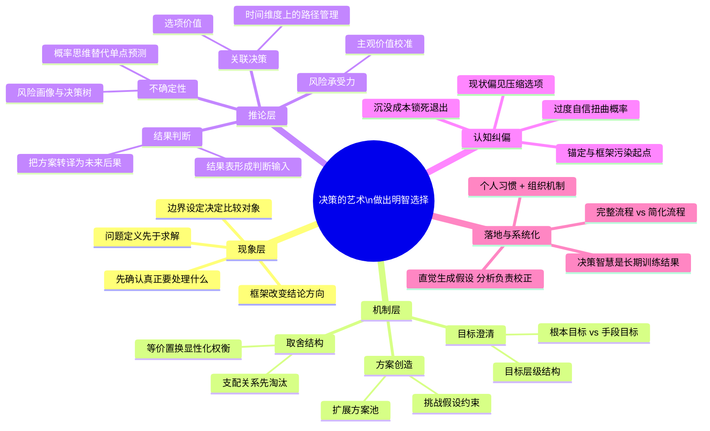
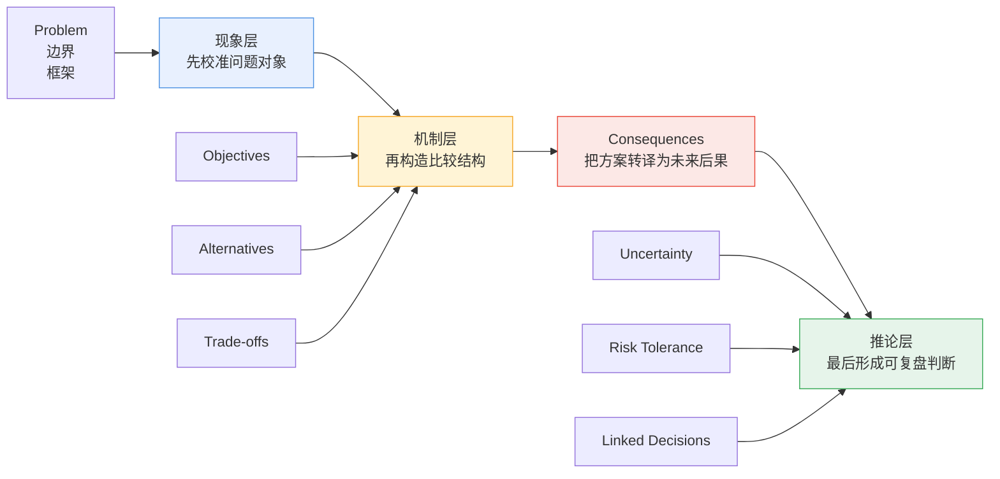
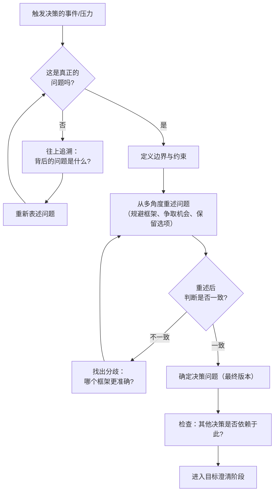
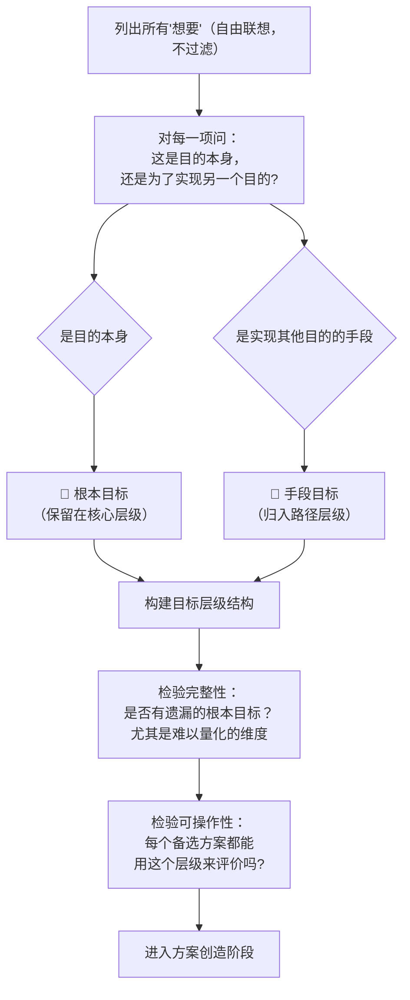
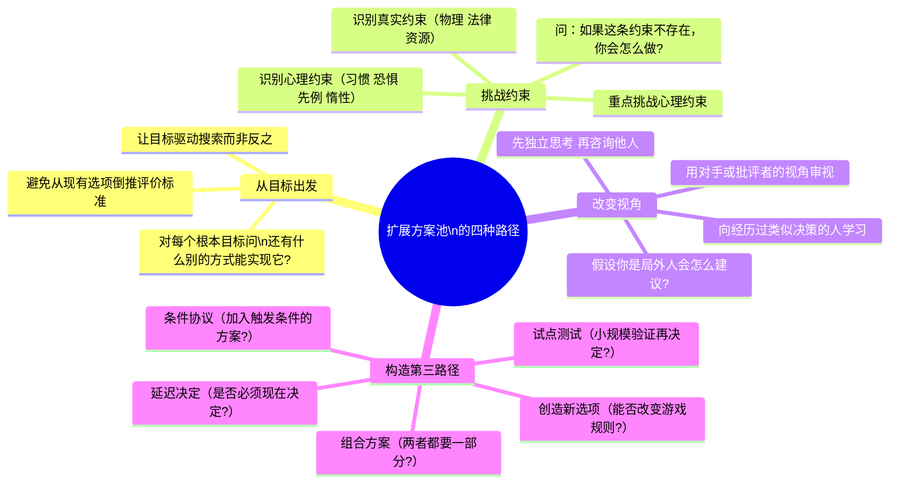
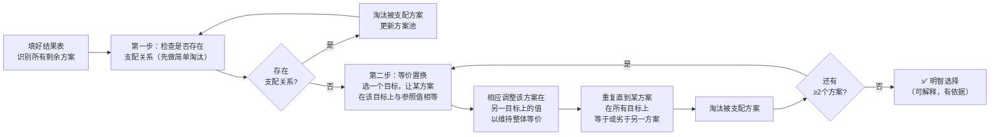
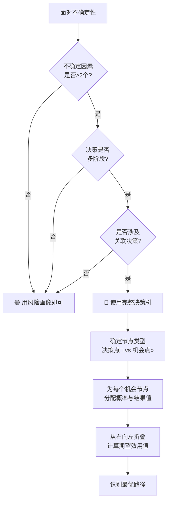
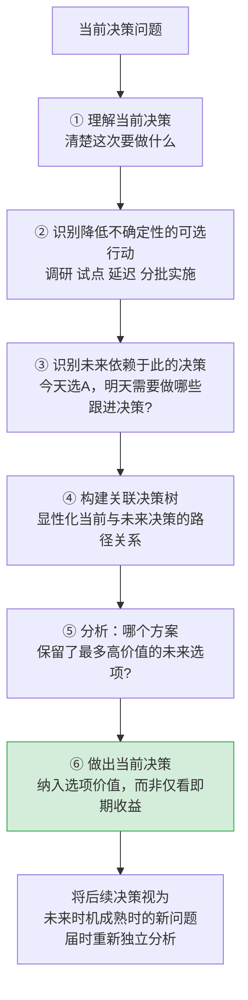
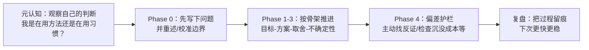

# 决策的艺术：系统化知识图谱 + 操作手册 v2

_John S. Hammond / Ralph L. Keeney / Howard Raiffa 著 | 王正林 译_

---

## 📌 阅读指南

| 章节 | 内容 | 适合什么时候读 |
| --- | --- | --- |
| 一～二 | 全书主线 + 逻辑架构图 | 首次阅读，建立全局观 |
| 三 | PrOACT+3 系统全景（含三层讲解框架 + 知识图谱） | 理解方法论主线时 |
| 四 | 按三层主线展开的要素深度解析（内含 SOP 与模板） | 想把主线与具体工具对上时 |
| 五 | 三大场景完整示例 | 需要参考案例时 |
| 六～七 | 批判性思考 + 术语表 | 延伸思考与快速检索 |

---

## 一、全书思考主线

**一句话本质**：把决策从“二选一”的选择题转换为**先把决策对象校准(问题定义)，再把比较结构搭起来，最后才对未来作出判断**思维框架，通过 PrOACT 把思维模型变成可学习、可复用、可复盘的决策流程，把聪明从天赋变成方法。

> 开始决策前，先启动元认知，问自己：**我是否在用正确的方式思考这个决定？** 避免通过直觉决策。

- 核心思想：**决策质量 ≠ 结果质量。** 结果有运气成分，过程才是你能控制的。一个好的过程不保证每次都赢，但能显著提升长期胜率**，并让你在任何结果下都能清晰复盘**。
- 核心思想：**价值优先于方案。** 不是先有选项再想标准，而是先把你真正在乎的说清楚，再去创造和评价选项。
- 核心思想：**决策智慧是一种可以终身训练的能力。** 不是每次都要走完全部流程，而是把"先想清楚在决定什么、再想清楚自己真正要什么"内化为思维习惯。

---

## 二、全书逻辑架构图



---

## 三、PrOACT+3 决策系统全景：从八要素到“三层讲解框架”

### 3.1 三层讲解框架

| 层次 | 对应内容 | 核心任务 | 关键问题 | 常见错误 |
| --- | --- | --- | --- | --- |
| **现象层** | `Problem` / 边界 / 框架 | 定义真正的决策对象 | 我到底在决定什么？边界在哪里？ | 问错问题、比错对象、被初始框架绑架 |
| **机制层** | `Objectives` / `Alternatives` / `Trade-offs` | 把模糊问题拆成可比较结构 | 我真正想要什么？有哪些方案？它们如何权衡？ | 把手段当目标、过早收敛、隐性取舍 |
| **推论层** | `Consequences` / 不确定性 / 风险承受力 / 关联决策 | 把结构化比较推进为对未来的判断 | 每个方案会导致什么？概率如何？我能承受什么风险？这些后果会怎样改变未来路径？ | 单点预测、忽视风险偏好、只看当下不看未来 |



- **现象层**回答的是：你究竟在处理什么问题。很多重大失误并不是“不会算”，而是“问错问题”“比错对象”“在错误边界里做精确分析”。
- **机制层**回答的是：你如何把一个混沌决策拆成可比较结构（比较什么，哪些维度）。目标、方案、结果与取舍的价值，不在于更复杂，而在于迫使判断显性化、可解释、可检视。
- **推论层**回答的是：当未来并不确定时，你如何把后果、概率、主观风险偏好与未来路径综合起来，形成一个真正值得承担的判断。

### 3.2 PrOACT 框架——防错骨架（八要素原始结构）

在保持三层主线的同时，仍有必要保留 PrOACT+3 的原始结构，因为它决定了这套方法在操作层面究竟要看哪些维度。下面这张表，把“原始要素清单”和“三层讲解框架”放在一起，便于同时理解。

| 要素 | 缩写 | 所属讲解层 | 核心问题 | 关键工具/方法 | 典型陷阱 | 与其他要素的关系 |
| --- | --- | --- | --- | --- | --- | --- |
| **问题定义** | Pr(Problem Framing) | 现象层 | 我真正要决定什么？ | 问题重述、触发因素分析、边界设定 | 框架陷阱、默认接受初始表述 | 问题定义影响所有后续步骤 |
| **目标澄清** | O(Objectives) | 机制层 | 我真正想实现什么？ | 根本/手段目标分离、目标层级 | 把手段当终点 | 目标驱动方案生成与结果比较 |
| **备选方案** | A(Alternatives) | 机制层 | 我有哪些可选路径？ | 挑战约束、独立思考、组合方案 | 过早收敛、伪二选一 | 方案池质量决定决策上限 |
| **结果** | C(Consequences) | 推论层（作为入口） | 每个方案会带来什么？ | 结果表、共同比例尺 | 忽略难量化维度 | 把结构化比较推进为对未来后果的判断，并为不确定性分析提供基础 |
| **取舍** | T(Trade-offs) | 机制层 | 如何在目标冲突时交换价值？ | 支配关系、等价置换法 | 只盯单一目标、取舍隐性化 | 建立在结果表基础上，决定进入推论层前的价值结构 |
| **不确定性** | U(Uncertainty) | 推论层 | 未来有几种可能？ | 风险画像、决策树、概率标定 | 过度自信、单点预测 | 将取舍从确定性推进到概率空间 |
| **风险承受力** | R(Risk Tolerance) | 推论层 | 我能承受多大的波动？ | 可取度评分、效用曲线 | 忽视主观风险态度差异 | 使同一概率分布因人得出不同决策 |
| **关联决策** | L(Linked Decisions) | 推论层 | 今天选择如何影响明天？ | 关联决策树、选项价值分析 | 局部最优、封死未来路径 | 为所有前序要素增加时间维度 |
| **心理纠偏** | — | 贯穿三层 | 我的判断是否被偏差污染？ | 偏差清单、外部视角、流程护栏 | 不知道自己不知道 | 贯穿全部要素的隐性校验层 |

---

### 3.3 防错护栏——心理陷阱 × 决策要素影响矩阵

> 核心思想：**心理陷阱不是偶发噪声，而是系统性污染源。** 它们在问题定义、方案搜索、概率估计、承诺退出四个阶段分别攻击你的判断——意识到这一点，是保持判断清醒的第一步。

| 心理陷阱 | 主要攻击哪个要素 | 典型症状 | 纠偏策略 |
| --- | --- | --- | --- |
| **锚定效应** | 问题定义、结果估计 | 第一个数字/方案主导后续判断，难以摆脱 | 先独立形成判断，再接触外部参照数字 |
| **框架效应** | 问题定义 | 同一选项换个表述就有不同选择 | 用至少 3 个不同框架重述同一问题 |
| **现状偏见** | 备选方案 | 默认维持现状，即便更优替代存在 | 问："如果从零开始，我会主动选择现状吗？" |
| **沉没成本** | 备选方案、取舍 | 因过去投入继续亏损路径 | 把已投入成本从当前比较中彻底排除 |
| **证实性偏见** | 结果评估、不确定性 | 只搜集支持既有看法的信息，忽视反证 | 主动寻找最强反证；设置"魔鬼代理人"角色 |
| **过度自信** | 不确定性 | 概率区间过窄，预测过于确定 | 有意扩大不确定性区间；考虑尾部极端情景 |
| **可获性启发** | 不确定性 | 近期、生动、情绪化的事件被赋予过高概率权重 | 查阅基础率数据，不只依赖记忆显著性 |
| **代表性启发** | 不确定性 | 依据表面相似性做判断，忽略基础概率 | 明确问："这类事件的总体基础概率是多少？" |

---

## 四、核心论述：按三层主线展开的要素深度解析

### 4.1 问题定义：一切从正确的问题开始

> "A good solution to a well-posed decision problem is almost always a smarter choice than an excellent solution to a poorly posed one." — 问题定义先于解法；解对了问题，比把错误问题解得再漂亮都有价值。

**为什么这是最被低估的一步？** 几乎所有的决策错误，都可以追溯到问题定义阶段。当我们说"我在做决定"时，通常是在一个被给定的框架里比较选项，而很少回过头问：这个框架是谁给的？它是否反映了我真正需要解决的问题？现实中，大多数人会接受决策情境的"初始表述"——媒体、老板、家人或习惯给出的那个版本，然后在这个版本里苦苦权衡，却不知道换一个问题本身，可能根本不需要那些权衡。

**"显然的问法"往往是错的。** 问题表述不是客观描述，而是价值判断和假设的混合体。"要不要接受这份工作"预设了只有接/不接两个选项；"要不要继续投入这个项目"携带着沉没成本的暗示；"该换城市吗"把一个居住安排问题压缩成了地理迁移问题。每一种表述，都悄悄地关上了某些门，开启了另一些门。作者的提醒极为干脆：**"一个被良好表述的问题，其一般性解决方案，通常胜过一个坏问题上的优秀求解。"**

**框架效应（Framing Effect）**：同一情境因表达方式不同而引发不同判断的现象。

**如何检验问题是否定义正确？** 有三个实用测试：

第一，**追溯测试**——问"这个问题背后的问题是什么"，看是否存在一个更本质的诉求；

第二，**重述测试**——把同一处境用三种不同方式表述（规避损失、争取机会、保留弹性），看结论是否一致，不一致则说明框架影响了判断；

第三，**依赖测试**——检查有没有其他决策依赖于这个问题的定义，如果有，定义错了代价会被放大。

**Phase 0：在开始分析之前**

- 已写下“我真正要决定的是什么”一句完整的话
- 已从至少 3 个不同角度重述过这个问题（规避损失、争取机会、保留弹性）
- 已检查：这是否是当前真正需要决定的问题，还是可以拆分或延迟？
- 已检查：是否存在一个“上层问题”让这个问题本身变得不那么关键？

**主动性是另一个关键。** 书中特别强调，不要等问题"发生在你身上"才做决定。最好的决策者会主动识别潜在决策机会——在压力逼近前就把问题构造出来，而不是被情绪与紧迫感驱动到错误的框架里。



**问题重构对照表**

| 原始表述 | 隐含局限 | 重构表述 | 扩展效果 |
| --- | --- | --- | --- |
| "要不要接受这个 offer？" | 预设只有接/不接 | "未来 3 年，哪种工作路径最符合我的核心目标？" | 催生更多备选，延迟或谈判也是选项 |
| "该不该换城市？" | 预设非此即彼 | "什么居住安排能最好地平衡家庭、工作和生活质量？" | 可能存在混合/弹性方案 |
| "要继续投入这个项目吗？" | 受沉没成本污染 | "如果今天才考虑这件事，我会选择继续吗？" | 去除历史包袱，还原真实判断 |
| "该买哪款产品？" | 预设必须购买 | "通过什么方式最好地满足这个需求？" | 租用、外包、DIY 可能是更优解 |
| "要不要辞职创业？" | 预设必须做出二选一 | "如何在职业发展中兼顾稳定性与创业探索？" | 内部创业、副业试水成为可选路径 |

---

### 4.2 目标澄清：价值优先于方案

**Keeney 的价值聚焦思维（Value-Focused Thinking）颠覆了通常的决策顺序。**

普通人的做法是：先看有哪些选项，再想用什么标准评价。这被 Keeney 称为"备选方案中心思维"——它是被动的，因为它让既有选项决定了评价维度，而不是由你真正的价值来驱动选项生成。

正确的顺序是反过来的：**先把你的价值系统说清楚，再去创造和评价方案**。这不仅是顺序问题，更是立场问题：谁来定义什么是"好结果"。

**根本目标（Fundamental Objectives）与手段目标（Means Objectives）的区分，是这套方法论的核心操作。** 根本目标是你最终关心的事情本身，比如家庭幸福、职业成就感、财务自由、健康。手段目标则是帮助你实现根本目标的路径，比如高收入、名校文凭、升职、买大房子。关键的危险在于：**当你把手段目标当成终点优化时，你很可能全力奔向一个错误的方向**。一个人拼命追求"高薪工作"（手段），却忽视了其根本目标是"有充足时间陪伴家人"（根本），这种张力就是目标混淆的结果。

**如何识别根本目标？** 一个简单的测试是：**不断追问"为什么"**。"我要高薪"→"为什么？"→"为了财务安全"→"为什么？"→"为了不担心意外"→"为什么？"→"因为我真正在乎的是生活的确定性和选择自由"。当你追问到"因为我就是这样认为的，这本身就是我的价值观"时，你找到了根本目标。

**目标清单一旦建立，它就成为整个决策框架的坐标系**——后续的方案生成、结果评估和权衡，都围绕这份坐标系展开。如果这个坐标系是错的或者不完整的，所有后续的"理性分析"都是在错误的方向上精确。



**手段 vs 根本目标对照**

| 手段目标（常被误认为终点） | 追问后发现的根本目标             |
| -------------------------- | -------------------------------- |
| 提高收入                   | 财务安全感 / 生活自由度          |
| 升职                       | 认可感 / 影响力 / 成就感         |
| 去名校读书                 | 知识成长 / 人脉资源 / 职业选择权 |
| 买大房子                   | 家庭稳定感 / 生活品质 / 归属感   |
| 提高品牌知名度             | 最终客户获取 / 业务可持续增长    |
| 减少工作时间               | 健康维护 / 家庭关系 / 个人恢复力 |
| 快速融资                   | 业务存活 / 发展速度 / 竞争优势   |

---

### 4.3 备选方案：你只能从你看见的选项中选择

> "You can never choose an alternative you haven't considered." — 决策质量的天花板由方案池决定；拓宽选项是最被低估的决策技能。

**决策中有一条绝对的上限定律：你永远不可能选择一个你没有考虑过的方案。**

这意味着，决策质量的天花板由你的方案池决定。就算后续的评估与权衡做得再精确，如果你的选项池里根本没有那个"最优解"，你也不可能找到它。然而大多数人在面对决策时，脑中浮现的选项通常只有两三个，而且往往是"显而易见的那些"——也就是受现状偏见、经验惯性和信息可及性影响最深的那些。

**扩展方案池需要创造力，而创造力需要有意识地打破框架。**

核心方法之一是**从目标出发而不是从现有选项倒推**：与其问"这几个方案哪个更好"，不如问"有没有别的方式能实现我的根本目标"。另一个方法是**区分并挑战约束**：那些看似固定的边界，往往不是客观约束，而是心理约束。"我不能降薪"、"我必须留在这座城市"、"这件事不能等"——每一条都值得质疑：它是真实的物理或法律限制，还是习惯与恐惧的产物？

**何时可以停止寻找方案？** 没有一个精确答案，但有一个判断原则：**当继续搜索的预期收益低于搜索成本时停止**。在高影响、高不可逆决策中，花更多时间拓宽方案池几乎总是值得的。而在低风险、可逆的决策里，过度搜索本身就是一种资源浪费。



---

### 4.4 结果评估：把方案翻译成后果

> "Be sure you really understand the consequences of your alternatives before you make a choice. If you don't, you surely will afterwards, and you may not be very happy with them." — 把方案翻译成后果，是比较的真正起点。

**方案名字本身没有意义，有意义的是它执行后在你关心的维度上带来什么。** "去大公司"和"去创业公司"本身不可比，但它们对收入稳定性、学习速度、自主权、长期风险四个维度的后果是可比的。**结果表（Consequence Table）** 的核心价值就在于强迫这种翻译发生——把模糊的"方案印象"转化为结构化的、按目标维度排列的后果描述。这个过程常常揭示出两种惊喜：某个"看起来不错"的方案在关键目标上其实很糟，或者某个"被忽视"的方案其实在多个维度都不差。

**结果表的填写有两个容易踩的坑。**

第一是**只填可量化的维度**，而把"关系质量"、"成长感"、"价值观匹配度"之类难以量化的东西排除在外——这会让表格变得"精确但失真"。

第二是**用不同尺度描述不同方案**，导致比较困难。作者建议在可行时使用**共同比例尺**（共同单位、共同等级），哪怕是粗略的"高/中/低"也好过无从比较。

**结果表还有一个直接功能：识别支配关系（Dominance）。** 如果方案 A 在所有目标上等于或优于方案 B，方案 B 就被 A 支配，可以直接淘汰。即便是"实践性支配"（方案 A 在部分目标上有微弱劣势，但在其他重要目标上的优势远超这点代价），也可以帮助你简化比较，不必把所有选项都带进复杂的权衡阶段。

**结果表模板**

| 目标维度 | 方案 A： | 方案 B： | 方案 C： |
| --- | --- | --- | --- |
| **根本目标 1**： |  |  |  |
| **根本目标 2**： |  |  |  |
| **根本目标 3**： |  |  |  |
| **主要风险/代价** |  |  |  |
| **难量化维度**： | 高 / 中 / 低 | 高 / 中 / 低 | 高 / 中 / 低 |
| **是否存在支配关系** | ☐ 支配其他 ☐ 被支配 | ☐ 支配其他 ☐ 被支配 | ☐ 支配其他 ☐ 被支配 |

---

### 4.5 权衡取舍：让价值交换显性化

> 核心思想：**取舍是现实的常态，不是失败的标志。** 问题不在于如何避免取舍，而在于如何把取舍做得显性、有原则、前后一致。

**多目标决策的现实，是几乎永远不可能所有目标都达到最大值。** 薪资高的工作通常自由度低；最安全的投资回报最小；照顾好职业的同时难以照顾好家庭。取舍不是失败的标志，而是现实的常态。问题不在于"如何避免取舍"，而在于"如何把取舍做得显性、有原则、前后一致"。当取舍是隐性的（在脑子里模糊地"感觉 A 比 B 好"），它往往被当下情绪、最近记忆和无意识偏好所主导，你事后也很难解释自己为什么选了这个。

**等价置换法（Even Swaps）是本书提供的最有力的权衡工具。** 它的逻辑是：不要直接问"哪个目标更重要"（这个问题几乎没有通用答案），而是问"为了在目标 X 上获得一定的改善，你愿意在目标 Y 上放弃多少"。通过反复做这种等价交换，你可以把一个多维度、难以直接比较的表格，逐步化简到某个方案在所有维度上不劣于另一个，这时候的选择就变得清晰了。这不是数学公式，而是迫使你把隐性的偏好转化为可解释的交换率。

**关于难量化目标的处理，作者的立场很明确：不量化不等于不纳入。** 如果你真的在意某件事，即便它无法被精确测量，也应该在结果表里有一席之地，并在权衡时被显性考虑。把它排除出去的唯一理由，是你认为它真的不重要——但如果那是真的，你又何必在意它无法量化？



---

### 4.6 不确定性：在多种可能中保持清醒

**不确定性不是障碍，而是决策情境的标准配置。** 大多数人在面对未来时，要么假装自己知道会发生什么（单点预测），要么被不确定性压倒而拖延决定。这两种反应都是逃避。作者的立场是：**承认不确定性，并把它结构化为可以纳入判断的形式**。核心工具是从"这件事会不会发生"转向"这件事发生的概率分布是什么"——这个思维模式的转换，是成熟决策者与普通人之间的重要分水岭。

**风险画像（Risk Profile）** 是一个简洁但强大的工具，它用四个问题把一个决策场景的不确定性结构化：关键不确定因素是什么？可能的结果有哪些？每种结果的概率大约多少？每种结果对决策目标的影响如何？这个四问框架不是让你"算出答案"，而是迫使你把脑中模糊的"也许""说不准"显性为可讨论的结构，从而避免在"感觉"层面做影响深远的判断。

**决策树（Decision Tree）是当不确定性因素多、决策多阶段时的升级工具。它的价值不在于数学计算，而在于强迫你把所有路径画出来**——包括你通常会忽略的那些。就像建筑师不会在没有蓝图的情况下开始施工，复杂的多阶段决策也不应该在没有决策树的情况下仓促前进。节点分两类：决策点（你可以选择的）和机会点（由不确定性决定的），清楚地区分这两类节点，能显著避免"以为自己能控制实际无法控制的事"的错觉。

**信息的价值**也是本章的重要洞察：不是所有信息都值得收集。在做一个决策之前花时间调研，其价值应当与"这个信息是否会改变我的决定"成正比。如果无论结果如何你都会做同样的选择，那这个信息就没有决策价值，不值得投入时间和资源去获取。

**风险画像工作表**

| 关键不确定因素 | 可能结果 | 估计概率 | 对决策目标的影响 |
| -------------- | -------- | -------- | ---------------- |
|                | 情景 A： | %        |                  |
|                | 情景 B： | %        |                  |
|                | 情景 C： | %        |                  |
|                | 情景 A： | %        |                  |
|                | 情景 B： | %        |                  |

**何时使用决策树？**



---

### 4.7 风险承受力：同一分布，不同选择

**风险是客观的，但对风险的感受是主观的。** 两个人面对同一个概率分布——60% 概率获得 10 万，40% 概率亏损 6 万——可能做出完全相反的选择。这不是因为他们其中一个"理性"另一个"感性"，而是因为他们有不同的风险承受力：对损失的敏感程度、当前的财务缓冲、时间压力、决策的可逆性，都会影响同一个结果在你眼中的"值不值"。**决策分析中的效用（Utility）或可取度（Desirability），就是把这种主观价值量化的工具**。

**人在大多数情境下是风险厌恶型的（Risk Averse）**，也就是说，损失 10 万的痛苦通常大于获得 10 万的喜悦。这不是缺点，而是一种现实的心理结构。承认它，可以帮你更诚实地评估风险——不是假装自己很大胆，而是清楚地了解自己真正能承受的波动范围，并在决策中如实反映。

**建立可取度评分的方法并不复杂。** 把最差结果定为 0 分，最好结果定为 100 分，然后为中间的几个参照结果打分，连成曲线。如果曲线上凸（向上弯），你是风险厌恶型；如果下凸（向下弯），你是风险寻求型；如果是直线，你是风险中性型。这条曲线不是一劳永逸的，它会随情境变化——同一个人在职业决策上可能风险厌恶，在某类投资上可能愿意冒险。

**对组织而言，风险态度不能只靠文化口号来管理。** 如果组织说"鼓励创新"但激励机制惩罚所有失败，员工自然会把激励结构而不是口号当成真正的风险偏好信号。管理者有三件具体的事可以做：画出组织的可取度曲线（定义可接受的风险范围）；通过典型案例传达风险标准；检查激励机制是否与期望的风险态度一致。

**风险承受力自评表**

| 维度 | 评估问题 | 你的回答 |
| --- | --- | --- |
| **损失接受度** | 这件事最坏的情景是什么？我能接受并继续前进吗？ |  |
| **波动敏感性** | 我更倾向稳定的小收益，还是愿意赌一个不确定的大收益？ |  |
| **时间恢复力** | 如果亏损，我能在多长时间内恢复？这段时间我能撑住吗？ |  |
| **可逆性** | 这个决策是否可逆？不可逆程度如何影响我对风险的容忍？ |  |
| **资源缓冲** | 我目前有多少余裕来承受不利结果，而不影响其他根本目标？ |  |

---

### 4.8 关联决策：今天的选择塑造明天的选项空间

> "The essence of making smart decisions is planning ahead." — 今天最好的决策，是那些同时为明天保留了最多高价值路径的选择。

**最聪明的决策，不仅看当下收益，还看它对未来选项的影响。** 很多决策不是孤立的一次性事件，而是一条链的节点：今天接受哪个工作，影响你三年后跳槽时的候选池；今天选择什么技术架构，决定明年你的产品迭代速度；今天是否在某个领域公开表态，影响你以后的策略弹性。**当前决策的"选项价值"——也就是它保留或关闭了多少未来可能性——是一个常被忽略但至关重要的判断维度。**

**这个视角有一个反直觉的推论：在高不确定性情境下，一个"现在看起来次优"的方案，可能因为它保留了更多未来选项而比"现在最优"的方案更值得选择。** 实物期权（Real Options）的概念就来源于此：灵活性本身有价值，尤其是当未来信息可能改变你的判断时，保留"可以等等再决定"的能力，通常比过早锁定更聪明。

**六步分析框架**：分析关联决策不是一次性规划到无穷远，而是在当前决策中清醒地识别它的时间维度。



> **核心句**：明智决策的本质在于提前规划。

---

### 4.9 整合工具：一页式决策画布与快速 SOP

前面 4.1 ～ 4.8 讲的是**为什么这样思考**；这一节把它们收束成**如何实际操作**。与其把工具单独放成一个与正文平行的章节，不如把它理解为：**问题定义、目标澄清、结果判断、风险评估与关联决策，最终都要落在同一张工作底稿上。** 这样做有两个好处：第一，避免“看完原理后不会下手”；第二，防止工具脱离前文逻辑，变成形式化填表。

更重要的是，这一节在“实现”第 1 章那种**元认知**：先审视自己的思考方式，再进入具体内容。元认知不是一句提醒，而是要被写进流程里——用 Phase 0 强制校准起点，用 Phase 4 强制做偏差检查，让“我到底在用方法还是在用习惯”变成每次决策都会触发的动作。



#### 4.9.1 决策启动检查清单

**Phase 0：在开始分析之前**

- 已写下“我真正要决定的是什么”一句完整的话
- 已从至少 3 个不同角度重述过这个问题（规避损失、争取机会、保留弹性）
- 已检查：这是否是当前真正需要决定的问题，还是可以拆分或延迟？
- 已检查：是否存在一个“上层问题”让这个问题本身变得不那么关键？

**Phase 1：目标与方案**

- 已列出所有“想要”，并区分根本目标 vs 手段目标
- 目标清单中包含所有真正在意的维度（包括难以量化的）
- 备选方案超过 3 个，且包含“延迟/试点/组合”类方案
- 已识别并挑战至少 1 条“必须如此”的默认假设约束

**Phase 2：评估与权衡**

- 已建立结果表（即使是草稿版，也要写在纸面上）
- 已检查支配关系（是否有明显差的方案可以先淘汰）
- 已明确回答“为了 X，我愿意放弃多少 Y”这类取舍问题
- 难量化目标已被显性纳入判断（用高/中/低也算）

**Phase 3：不确定性与风险**

- 已识别影响结果的主要不确定因素（至少 2 ～ 3 个）
- 已考虑最坏情景，并评估其可接受性
- 已考虑这个决策与未来其他决策的关联
- 已评估哪个方案保留了最多高价值的未来选项

**Phase 4：认知纠偏**

- 我的初始判断是否受到了某个“锚点”的影响？
- 我是否有意或无意地回避了某些反证？
- 我是否因为过去投入过多而难以客观评估退出的必要性？
- 如果让一个不了解背景的外部理性人看这个问题，他会怎么评估？

#### 4.9.2 一页式决策画布

```
┌──────────────────────────────────────────────────────────────────────┐
│  决策题目：________________________    日期：________  版本：v___   │
├──────────────────────────────┬───────────────────────────────────────┤
│  📍 问题定义（最终版本）       │  🎯 根本目标（≤5个，只写终点）        │
│                               │  1.                                   │
│  （用一句完整的话表述）        │  2.                                   │
│                               │  3.                                   │
│                               │  4.                                   │
│                               │  5.                                   │
├──────────────────────────────┴───────────────────────────────────────┤
│  📊 结果比较表                                                        │
├─────────────────┬────────────────┬────────────────┬──────────────────┤
│  目标维度        │ 方案A：_______ │ 方案B：_______ │ 方案C：_______   │
├─────────────────┼────────────────┼────────────────┼──────────────────┤
│  根本目标1       │                │                │                  │
│  根本目标2       │                │                │                  │
│  根本目标3       │                │                │                  │
│  主要风险/代价   │                │                │                  │
│  难量化维度      │ 高/中/低       │ 高/中/低       │ 高/中/低         │
│  支配关系        │ ☐支配 ☐被支配  │ ☐支配 ☐被支配  │ ☐支配 ☐被支配    │
├─────────────────┴────────────────┴────────────────┴──────────────────┤
│  ⚖️ 主要权衡（等价置换）         │  🎲 主要不确定因素 + 概率估计       │
│                                  │                                    │
│                                  │                                    │
├──────────────────────────────────┼────────────────────────────────────┤
│  😱 最坏情景及可接受性            │  🔗 与未来决策的关联               │
│                                  │                                    │
│                                  │                                    │
├──────────────────────────────────┼────────────────────────────────────┤
│  🧠 认知偏差检查                  │  ✅ 初步判断                       │
│  ☐ 锚定   ☐ 框架   ☐ 证实偏见    │                                    │
│  ☐ 现状偏见  ☐ 沉没成本           │                                    │
│  ☐ 过度自信  ☐ 可获性偏差         │                                    │
└──────────────────────────────────┴────────────────────────────────────┘
```

#### 4.9.3 三个局部模板（直接对应前文关键环节）

**A. 风险画像工作表**

| 关键不确定因素 | 可能情景 | 估计概率 | 对决策目标的影响 |
| -------------- | -------- | -------- | ---------------- |
|                | 情景 A： | %        |                  |
|                | 情景 B： | %        |                  |
|                | 情景 C： | %        |                  |

**B. 关联决策规划表**

| 当前决策 | 今天可以做什么来降低不确定性 | 依赖于此的未来决策 | 当前方案对未来选项的影响 |
| --- | --- | --- | --- |
|  |  |  | 开放 / 限制 / 中性 |
|  |  |  | 开放 / 限制 / 中性 |
|  |  |  | 开放 / 限制 / 中性 |

**C. 等价置换微模板**

- 我当前最纠结的两个目标是： 与
- 如果方案 A 在目标 X 上提升 ，我愿意在目标 Y 上最多让渡
- 一旦把这个交换说清楚，哪个方案开始显出优势？

---

## 五、三大场景完整示例

### 场景一：职业决策（是否换工作）

**情境**：在当前稳定工作（公司中层管理，薪资稳定但成长受限）与一个创业公司 offer（薪资下降 20%，但股权可观，成长空间大）之间做选择。

**Step 1 — 问题定义**

- 原始表述："要不要接受这个 offer？"
- 重构表述："**未来 3 年，哪种职业路径最能推进我的核心目标，同时保留最多的未来选项？**"
- 新增选项：延迟决定（谈判 3 个月入职期）、内部申请转岗、先以顾问身份测试创业公司

**Step 2 — 目标澄清**

| 根本目标           | 手段目标（排除出决策核心） |
| ------------------ | -------------------------- |
| 职业成就感与影响力 | 职级头衔                   |
| 长期财务安全       | 短期薪资                   |
| 学习成长速度       | 读什么学位                 |
| 家庭时间与生活质量 | 工作地点                   |
| 未来职业选择权     | 公司品牌                   |

**Step 3 — 结果表**

| 根本目标 | 方案 A：留当前工作 | 方案 B：加入创业公司 | 方案 C：延迟+谈判 |
| --- | --- | --- | --- |
| 职业成就感 | 中（受层级限制） | 高（直接参与核心） | 中（等待期信息收集） |
| 长期财务安全 | 高（稳定） | 中高（风险+股权） | 中（延迟决策的代价） |
| 学习成长速度 | 低 | 高 | 中 |
| 家庭时间 | 高 | 中（初期投入大） | 高 |
| 未来职业选择权 | 中（行业限制） | 高（创始团队经历） | 高 |

**Step 4 — 权衡**：方案 A 被方案 B 在成就感、学习成长、职业选项价值上支配（除财务稳定性）。等价置换：我愿意接受 20% 薪资降幅换取高成长和高选项价值吗？→ 答案取决于风险承受力和家庭财务缓冲。

**Step 5 — 不确定性**：创业公司的关键不确定因素：产品市场适应度（30%/50%/20%概率对应高/中/低结果）、创始团队稳定性。

**Step 6 — 关联决策**：加入创业公司会影响 2 年后的融资轮次中是否有机会升职、5 年后是否有能力独立创业。这些路径价值需要纳入当前判断。

---

### 场景二：商业决策（是否进入新市场）

**重点聚焦：不确定性与风险承受力**

某公司正在评估是否进入东南亚市场，主要不确定因素包括监管环境、竞争格局和本地化难度。

**风险画像核心**：

| 不确定因素   | 乐观情景 (25%) | 中性情景 (50%)      | 悲观情景 (25%)     |
| ------------ | -------------- | ------------------- | ------------------ |
| 监管通过速度 | 6 个月内       | 12 ～ 18 个月       | 超过 24 个月或被拒 |
| 市场竞争强度 | 蓝海，无强对手 | 1 ～ 2 个有力竞争者 | 本土强对手已占优   |
| 本地化成本   | 预算的 80%     | 预算的 120%         | 预算的 200%+       |

**风险承受力匹配**：公司当前现金流可支持 18 个月的无回报投入。如果悲观情景发生（概率约 15.6%），损失是否在可接受范围内？如果是，可以进入；如果不是，考虑分阶段进入（保留关联决策的灵活性）。

---

### 场景三：个人重大决策（是否移居/购房）

**重点聚焦：关联决策与难量化目标**

**难量化目标的处理**：

| 难量化目标   | 如何进入决策                                   |
| ------------ | ---------------------------------------------- |
| 归属感       | 对比两地的社交网络密度、文化认同感（高/中/低） |
| 家人关系维护 | 量化飞行频次和时间成本，但也直接评估情感影响   |
| 城市"感觉对" | 在打分时专设一行"整体主观偏好"，给 0-10 分     |

**关联决策规划**：

| 当前决策 | 未来依赖决策 | 方案 A（留）的影响 | 方案 B（移居）的影响 |
| --- | --- | --- | --- |
| 是否移居 | 3 年后的子女教育选择 | 保留当前学校系统 | 进入新的教育系统 |
| 是否移居 | 5 年内是否买房 | 可在熟悉市场购房 | 需要在陌生市场决策 |
| 是否移居 | 父母养老安排 | 距离近，照料方便 | 需要提前设计远程支持机制 |

**关键洞察**：移居决策本身是一个高不可逆、多关联的决策。在判断时，不只比较"两地生活的直接优势"，更要回答：**哪个选择保留了更多高价值的未来路径？** 不可逆程度越高，保留弹性的价值就越大——因此"先短期租住体验、再决定是否购房"往往比"直接购房搬迁"更符合关联决策逻辑。

---

## 六、批判性思考：这套方法的边界与延伸

### 6.1 理论的局限性

**1. 偏规范理性，低估了权力政治与情绪博弈** PrOACT 是一套理想条件下的框架——它假设你可以自由定义问题、清晰陈述目标、自主扩展方案。但现实中，许多重要决策发生在组织政治、利益博弈和情绪张力之中。老板已经有了倾向性，团队有隐性议程，"合理分析"的结果可能永远无法真正进入讨论。这套方法对这类动态几乎没有覆盖。

**2. 假设偏好可以被澄清，但偏好会在选择过程中演化** 本书的一个核心假设是：你已经有了稳定的价值偏好，只是还没把它说清楚。但很多重要的人生决策，本质是"你在选择中才发现自己是谁"——偏好不是待揭示的，而是在实践中形成的。这意味着，有时候"先行动、再反思"比"先澄清再行动"更真实。

**3. 量化陷阱：可以量化的不等于重要的** 结果表和等价置换法的力量部分来自量化——但这也可能带来一种隐性偏向：数字能填的维度被更认真对待，难量化的维度被"象征性保留"。现实中，关系质量、价值观吻合度、使命感往往是最重要的，却最难进入结构化分析。

**4. 高速动态环境需要补充方法** 在算法竞争、实时博弈、快速迭代的场景中，决策速度、对手反应速度和系统反馈的速度，可能比一次周全分析更重要。PrOACT 更适合"慢决策"场景，快速决策需要结合其他工具（如预演、规则化决策、快速实验）。

---

### 6.2 在当今环境下的延伸应用

**1. AI 辅助决策：PrOACT 可以成为提示词模板** 你可以直接把 PrOACT 框架转化为一套 AI 提示链：让 AI 帮你重构问题定义（"给我三种不同的方式表述这个问题"）、扩展备选方案（"基于我的根本目标，还有哪些方案我没有考虑"）、生成反证（"这个决策最强的反对意见是什么"）。AI 擅长广度，人负责价值判断与最终权衡。

**2. 职业路径设计：关联决策思维的核心应用场景** 现代职业路径已不是线性的。关联决策和选项价值对于思考"今天选择什么技能/公司/项目，会在 3-5 年后开放哪些高价值路径"尤其有力。保留弹性、延迟最终承诺、在可逆的早期阶段多探索——这些都是关联决策逻辑的自然应用。

**3. 医疗与复杂个人决策中的共同决策** 在重大医疗方案选择、教育路径规划、养老安排等场景，PrOACT 可以成为患者/家庭与专业人员之间的**共享语言**：双方用同一个框架讨论目标（根本目标是什么）、结果（每个方案会带来什么后果）和不确定性（哪些是未知的），大幅提升沟通质量。

**4. 组织制度设计：把反偏差机制制度化** 比"提醒大家要理性"更有效的方式，是把防偏差机制嵌入流程中。例如：重大决策前强制列反证、重大投资前强制写退出条件、区分可逆与不可逆决策并对后者要求更高审批门槛、在决策会议中专设一个"魔鬼代理人"角色——这些是将第 10 章的认知纠偏思想转化为组织机制的具体做法。

---

## 七、核心术语速查卡

| 术语 | 英文 | 简明定义 |
| --- | --- | --- |
| **PrOACT** | PrOACT | 问题、目标、备选方案、结果、取舍五个核心决策要素的缩写。 |
| **问题定义** | Problem Framing | 把模糊处境转化为清晰、可操作决策任务的过程。 |
| **框架效应** | Framing Effect | 同一情境因表述方式不同而引发不同判断的现象。 |
| **根本目标** | Fundamental Objectives | 你在特定情境中真正想实现的终点性价值。 |
| **手段目标** | Means Objectives | 帮助实现根本目标的路径性条件，不是目的本身。 |
| **目标层级** | Objectives Hierarchy | 将抽象价值拆解为可比较子目标的结构化体系。 |
| **价值聚焦思维** | Value-Focused Thinking | Keeney 提出的"价值先于备选方案"的决策思维范式。 |
| **方案池** | Alternative Set | 一个决策中被认真纳入考虑的全部候选行动路径。 |
| **结果表** | Consequence Table | 以目标为维度、以方案为列，展示多目标后果的比较矩阵。 |
| **支配关系** | Dominance | 方案 A 在所有目标上等于或优于方案 B，则 A 支配 B。 |
| **等价置换法** | Even Swaps | 通过在不同目标间做等值交换，逐步化简多目标权衡。 |
| **取舍** | Tradeoff | 在无法同时最大化所有目标时，做有原则、可解释的价值交换。 |
| **风险画像** | Risk Profile | 对关键不确定因素、可能情景、概率与后果影响的结构化描述。 |
| **决策树** | Decision Tree | 图示化展示决策节点、机会节点及后果路径的工具。 |
| **风险承受力** | Risk Tolerance | 个体或组织愿意承受不利结果波动的程度。 |
| **效用/可取度** | Utility / Desirability | 结果在主观上"有多值得"的量化衡量，反映个人风险偏好。 |
| **关联决策** | Linked Decisions | 当前选择会影响未来可选方案集合的决策链结构。 |
| **选项价值** | Option Value | 某选择因保留未来可能性而具有的附加价值。 |
| **锚定效应** | Anchoring Trap | 最初信息对后续判断施加不成比例的影响。 |
| **沉没成本谬误** | Sunk Cost Trap | 因过去已投入资源而继续错误路径的倾向。 |

---
