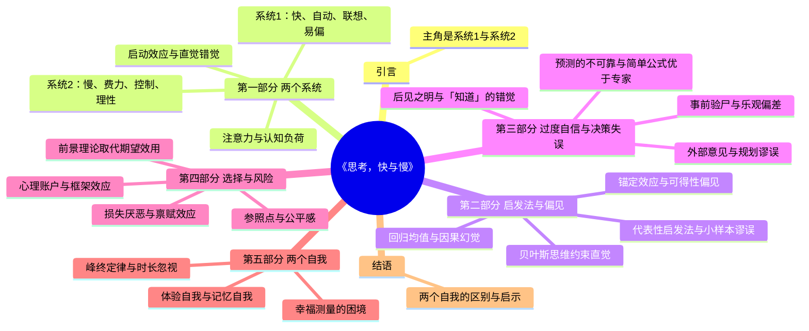

# 《思考，快与慢》读书分析

**作者**：丹尼尔·卡尼曼（Daniel Kahneman）  
**译者**：胡晓姣、李爱民、何梦莹

---

## 一、全书逻辑架构（Mermaid 思维导图）

---

## 二、逐章深度分析

### 引言

**【核心议题】**  
本书的核心问题：人脑中有两套决策系统（系统 1 与系统 2），它们如何分工、何时出错，以及我们如何在与理性人假设不符的情况下做判断与选择。

**【关键证据/案例】**  
卡尼曼以自身研究与特沃斯基多年合作为主线，说明「快思考」自动、联想、易受情境影响，「慢思考」费力、需注意力；多数时候我们以为在理性思考，实则被系统 1 主导。

**【底层思维模型】**  
双系统模型（Dual-Process Theory）：系统 1 对应直觉与启发式，系统 2 对应有意识的推理与自控；二者协作与冲突构成了判断偏见的来源。

**【复盘思考】**  
在日常生活中，你能否举出一件「当时觉得理所当然，事后发现是直觉骗了你」的决定？如何设计一个简单机制，在重要决策前触发系统 2？

---

## 第一部分 两个系统

### 第 1 章 一张愤怒的脸和一道乘法题

**【核心议题】**  
系统 1 负责自动加工（如识别人脸、理解句子），系统 2 负责需要集中注意力的任务（如复杂运算）；当系统 1 遇到困难时会求助系统 2，二者存在冲突与自我控制。

**【关键证据/案例】**  
看到愤怒的脸会立刻产生情绪反应（系统 1）；做 17×24 这类乘法需要心算与工作记忆（系统 2）。瞳孔实验表明：认知负荷越大，瞳孔扩张越明显，说明系统 2 被激活。

**【底层思维模型】**  
认知资源有限性：注意力是稀缺资源，系统 2 激活会抑制系统 1 的自动反应；自我控制本质是系统 2 对系统 1 的抑制。

**【复盘思考】**  
在疲劳或饥饿时，你是否更容易对他人发火或做出冲动决定？能否用「认知负荷」解释「又累又饿的法官更可能拒绝保释」？

---

### 第 2 章 电影的主角与配角

**【核心议题】**  
注意力像聚光灯，只能集中在有限信息上；未被注意的信息可能被完全忽略（如「看不见的大猩猩」），瞳孔变化可视为思维强度的生理指标。

**【关键证据/案例】**  
「看不见的大猩猩」实验：被试在数传球次数时，多数人未注意到穿大猩猩服装的人走过画面。瞳孔直径随心算难度增加而增大，可作为认知努力的客观指标。

**【底层思维模型】**  
选择性注意与注意盲：我们以为自己在看「整幅画面」，实则只加工了被注意的局部；系统 1 的连贯性会填补空白，制造「看见全部」的错觉。

**【复盘思考】**  
在会议或阅读时，你是否曾事后发现漏掉了关键信息？如何用「注意分配」改进关键决策前的信息收集？

---

### 第 3 章 惰性思维与延迟满足的矛盾

**【核心议题】**  
系统 2 具有惰性，不愿轻易启动；自我控制（如延迟满足）依赖系统 2，在认知资源被消耗（如疲劳、饥饿）时更容易失败。

**【关键证据/案例】**  
保释官在临近用餐前更倾向于拒绝保释（节省认知资源、减少纠结）。「2+2=？」会直接得到 4，而复杂题目会让人「脱口而出错误答案」再修正，说明系统 1 先反应、系统 2 后介入。

**【底层思维模型】**  
自我损耗（Ego Depletion）的早期版本：认知与情绪自控共用有限资源，资源耗尽时直觉与冲动占上风。

**【复盘思考】**  
重要谈判或考核是否应避免安排在饭点前？你能否用「认知预算」来安排一天中需要深度思考的任务？

---

### 第 4 章 联想的神奇力量

**【核心议题】**  
系统 1 通过联想自动激活相关概念与情绪；启动效应表明，无关线索（如词语、动作）会在无意识中影响后续判断与行为。

**【关键证据/案例】**  
「香蕉」「呕吐」的联想会让人对后续信息更敏感。嘴里含铅笔做出微笑动作会让人觉得漫画更好笑——概念与身体状态通过联想绑定。

**【底层思维模型】**  
联想记忆网络：概念节点被激活后会扩散到相关节点；启动是自动的、无意识的，却会系统性改变判断。

**【复盘思考】**  
环境中的哪些「小线索」可能在不经意间影响你的情绪或判断？能否主动设计正向启动（如办公环境、开场问题）？

---

### 第 5 章 你的直觉有可能只是错觉

**【核心议题】**  
熟悉感、流畅感容易被误判为「正确」或「真实」；记忆中的易得性、情感强度会扭曲我们对概率与因果的判断。

**【关键证据/案例】**  
股票代码上口、易记的公司，人们会误判其回报更高。容易想象或回忆的事件被认为更可能发生。创新常出现在能激发联想、打破常规的环境中。

**【底层思维模型】**  
流畅性启发：加工越容易，主观真实感与信心越强；系统 1 不区分「容易想到」与「真的更可能」。

**【复盘思考】**  
你最近一次「觉得很有把握」的判断，是否可能只是「想得很顺」？如何用「反流畅」检验（如换一种表述、问相反问题）？

---

### 第 6 章 意料之外与情理之中

**【核心议题】**  
系统 1 会快速构建「常态」与因果叙事，将意外事件纳入「事后看来合理」的故事，从而高估自己事先的预测能力。

**【关键证据/案例】**  
第一次遇到意外会惊讶，第二次类似事件则被纳入「常态」。眼见为实的倾向让我们过早下结论，忽略统计与基准信息。

**【底层思维模型】**  
常态理论（Norm Theory）：我们不断更新「正常」的参照；事后叙事会重构记忆，制造「我早就知道」的后见之明。

**【复盘思考】**  
复盘时，你是否常觉得「当时本该想到」？如何区分「事后合理化」与「事前本当能推理出来」？

---

### 第 7 章 字母「B」与数字「13」

**【核心议题】**  
情境（上下文）会强烈影响我们对同一刺激的解读；我们倾向于相信连贯的故事而非统计事实，光环效应与「眼见为实」会强化这种倾向。

**【关键证据/案例】**  
在「A B C」中看到的是 B，在「12 13 14」中看到的是 13——同一形状，不同解读。连贯叙述比零散数据更有说服力；群体在某些条件下能汇聚智慧，但在其他条件下会放大偏见。

**【底层思维模型】**  
情境依赖的知觉与判断：系统 1 追求连贯性，会主动「填满」语境；信念与偏好常被首因、光环等效应绑架。

**【复盘思考】**  
在做判断时，你是否曾因「故事讲得好」而高估其可信度？如何主动引入统计与反例来对冲叙事效应？

---

### 第 8 章 我们究竟是如何作出判断的？

**【核心议题】**  
我们常通过「替代」用简单问题（如「这人看起来像赢家吗？」）的答案来回答复杂问题（如「谁更可能当选？」），替代过程多为无意识。

**【关键证据/案例】**  
看照片预测竞选胜出者的准确率可高达约 70%——并非因为长相决定能力，而是因为选民用「谁看起来更像领导人」替代了「谁更适合治国」。平均长度与总长度被系统 1 混淆。

**【底层思维模型】**  
启发式与替代：目标问题难以直接回答时，系统 1 会找一个容易的问题来替代，并把答案当作对原问题的回答。

**【复盘思考】**  
你在评估人、项目或机会时，是否经常其实在回答另一个更简单的问题？如何显式列出「我真正要回答的问题」？

---

### 第 9 章 目标问题与启发性问题形影不离

**【核心议题】**  
三种典型启发式：代表性（像不像某类）、可得性（想不想得到）、锚定与调整；情感启发式则用「喜不喜欢」替代「对不对」。

**【关键证据/案例】**  
立体启发法：远处物体看起来更大（用空间直觉替代理性估计）。情感启发式：因为喜欢某人或某方案，所以更倾向认同其观点或可行性。

**【底层思维模型】**  
启发式是系统 1 的省力策略：用局部线索替代全局计算；高效但容易产生可预测的偏见。

**【复盘思考】**  
在做重要判断时，能否先写下「目标问题」和「我实际在用的启发式」，再检查二者是否一致？

---

## 第二部分 启发法与偏见

### 第 10 章 大数法则与小数定律

**【核心议题】**  
统计规律只在大样本中稳定；小样本波动极大，但人们常对小样本过度解读，赋予因果意义，忽视随机性。

**【关键证据/案例】**  
小样本出错风险可能高达 50%。人们倾向于对随机序列找规律、对巧合赋因果。普遍存在「信任多于质疑」的偏见。

**【底层思维模型】**  
大数法则 vs 小数定律：大数法则要求样本足够大才稳定；小数定律是心理学现象——人们误把小样本当作有代表性的信号。

**【复盘思考】**  
你是否曾根据少量案例（如几次成功/失败）就总结出「规律」？如何设定「至少多少样本再下结论」的自律规则？

---

### 第 11 章 锚定效应在生活中随处可见

**【核心议题】**  
任意数字或信息一旦成为「锚」，会系统性拉高或拉低后续估计；对锚的调整往往不足，暗示本身即可制造锚定。

**【关键证据/案例】**  
先问「联合国中非洲国家比例是否高于 65%」再让估计比例，估计值会明显高于先问「是否低于 10%」的组。谈判中的先出价、问卷中的默认值都是锚。

**【底层思维模型】**  
锚定与不充分调整：系统 1 从锚出发做微调，而非从零开始重算；锚可以是完全无关的数字。

**【复盘思考】**  
在报价、评估或规划时，谁在设定你的「锚」？能否主动引入多个锚或反锚（如从高和从低各估一次再取中）？

---

### 第 12 章 科学地利用可得性启发法

**【核心议题】**  
「容易想到」会被当作「更常发生」或「更重要」；可得性受媒体、亲身经历、情绪影响；意识到这种偏见有助于改善团队沟通与自我认知。

**【关键证据/案例】**  
近期新闻、身边案例会提高可得性，从而高估相应风险或概率。意识到自己存在可得性偏见，能减少因此产生的争执与误判。

**【底层思维模型】**  
可得性启发：用「想起的容易程度」替代「客观频率或重要性」；记忆与检索过程被多种因素污染。

**【复盘思考】**  
你对某类风险或机会的判断，是否可能被最近看到的报道或故事扭曲？如何用统计数据校准可得性？

---

### 第 13 章 焦虑情绪与风险政策的设计

**【核心议题】**  
公众对风险的感知与统计概率严重脱节；情绪（如焦虑、恐惧）会放大某些低概率风险，影响政策与资源分配。

**【关键证据/案例】**  
被闪电击中与食物中毒的致死率对比：后者实际更高，但前者更易引发恐惧。小概率但骇人听闻的事件可能演变为公共危机，导致过度应对或忽视更大概率风险。

**【底层思维模型】**  
风险感知的双系统：情绪驱动对「可怕但罕见」事件的过度反应；理性则更依赖概率与期望损失。政策需兼顾两者。

**【复盘思考】**  
你所在组织是否曾因「一起极端事件」而改变整体策略？如何平衡情绪安抚与基于概率的资源配置？

---

### 第 14 章 猜一下，汤姆的专业是什么？

**【核心议题】**  
人们依据「典型性」（像不像某类人）做预测，而忽视基础比率；贝叶斯定理要求结合先验（基础比率）与证据（典型性），可用来约束直觉。

**【关键证据/案例】**  
汤姆被描述为「内向、爱读书、喜欢秩序」——多数人猜他是图书馆员而非商人，尽管商人基数远大于图书馆员。典型性替代了概率计算。

**【底层思维模型】** 代表性启发 + 忽视基础比率：系统 1 用相似度代替概率；贝叶斯更新是规范模型，可用来校正直觉。

**【复盘思考】**  
在招聘或投资判断中，你是否过度依赖「像不像成功者」而忽视行业/赛道的基础成功率？如何显式使用基础比率？

---

### 第 15 章 琳达问题的社会效应

**【核心议题】**  
「琳达是银行出纳」与「琳达是关心女权问题的银行出纳」——联言（A 且 B）不可能比单言（A）更可能，但人们常违反这一逻辑，因为「更具体的故事」更符合代表性。

**【关键证据/案例】**  
琳达问题：多数人选「银行出纳且女权主义者」而非「银行出纳」，违背概率论（联言概率 ≤ 单言概率）。少即是多的逻辑悖论在社会层面广泛存在。

**【底层思维模型】**  
合取谬误：更详细、更「像某类人」的描述反而被认为更可能，因为系统 1 用代表性替代概率。

**【复盘思考】**  
你是否曾因某个描述「太具体、太像」而高估其真实性？如何用「少即是多」检验：去掉细节后概率应更高。

---

### 第 16 章 因果关系比统计学信息更具说服力

**【核心议题】**  
有因果叙事的基础比率会被采用，纯统计的基础比率常被忽视；我们天生偏好因果思维，统计思维需要刻意训练。

**【关键证据/案例】**  
当基础比率被包装成「有原因」的故事时，人们会使用它；当它只是冷冰冰的统计时，人们更依赖个案与典型性。我们很难具备统计型思维，因为系统 1 偏爱故事。

**【底层思维模型】**  
因果基率与思维定式：因果解释满足系统 1 对连贯性的需求；统计信息缺乏叙事，容易被忽略。

**【复盘思考】**  
在决策时，你是否更愿意相信「因为 A 所以 B」的故事，而轻视「从统计上看 B 的概率是 X」？如何给统计信息赋予「可理解的因果」？

---

### 第 17 章 所有表现都会回归平均值

**【核心议题】**  
极端表现之后往往会向平均值靠拢，这不是因果，而是统计必然；人们却常把「第二次不如第一次」归因于批评或干预，产生因果幻觉。

**【关键证据/案例】**  
卡尼曼称回归平均值的意义不亚于发现万有引力。教练在队员表现极好后批评，表现极差后表扬，会误以为批评/表扬「有效」，实则多是回归效应。

**【底层思维模型】**  
回归均值：任何带随机性的测量，极端值后更可能出现较不极端的值；因果归因常把回归误读为干预效果。

**【复盘思考】**  
你是否曾把「上次太好这次变差」归因于某人或某政策？能否先用「回归均值」做零假设，再考虑因果？

---

### 第 18 章 如何让直觉性预测更恰当有效？

**【核心议题】**  
直觉预测常过度极端（过于自信）；更恰当的做法是用统计规律向均值回归，或用简单公式替代纯直觉。

**【关键证据/案例】**  
偏离预测方向的直觉：直觉往往对极端情况过度反应。将预测向基准、向平均值拉回，能提高校准度。

**【底层思维模型】**  
预测校准：直觉需要被「回归」与「基准」约束；公式化预测在多数领域优于非结构化专家判断（为第三部分铺垫）。

**【复盘思考】**  
你的直觉预测是否经常「太极端」？能否为关键预测设定「基准 + 调整上限」的简单规则？

---

## 第三部分 过度自信与决策失误

### 第 19 章 「知道」的错觉

**【核心议题】**  
后见之明让我们在事后觉得「早就知道」，高估事前可预测性；这种错觉会带来真实的社会成本（如过度问责、错误归因）。

**【关键证据/案例】**  
企业基业长青的「秘诀」多为事后总结，难以事前复制。对不确定性的无偏见评价要求我们承认「当时无法知道」，与后见之明本能相悖。

**【底层思维模型】**  
后见之明偏差：记忆被事后信息污染，我们会重构「当时就知道」的叙事；真实决策应基于事前信息与概率。

**【复盘思考】**  
复盘时能否区分「当时已知」与「事后才明显」？能否用「事前记录理由」减少后见之明？

---

### 第 20 章 未来是不可预测的

**【核心议题】**  
许多领域的专家预测并不比随机或简单规则更准；在缺乏有效、及时反馈的环境中，技能无法通过经验可靠习得。

**【关键证据/案例】**  
专家预测准确度有时不如扔飞镖的猴子。股票预测不可靠。在结果滞后、噪声大、样本少的领域，直觉难以被校准。

**【底层思维模型】**  
可预测性取决于环境结构：只有规律稳定、反馈及时的环境，才适合发展专家直觉；否则应依赖统计与规则。

**【复盘思考】**  
你所在领域是「高反馈、高规律」还是「低反馈、高噪声」？这应决定你更信专家直觉还是更信算法/规则。

---

### 第 21 章 直觉判断与公式运算，孰优孰劣？

**【核心议题】**  
在预测任务中，简单公式或统计模型往往优于专家综合判断；专家会受无关信息与主观偏好影响。

**【关键证据/案例】**  
大量研究表明：用少量关键变量构建的线性模型，预测表现稳定优于专家；专家难以稳定地给线索赋权。

**【底层思维模型】**  
机械预测 vs 临床判断：公式保证一致性与权重稳定；人类判断易受情境、顺序、情绪影响，但人们仍过度信任专家。

**【复盘思考】**  
你的关键决策是否已有「简单公式」版本？能否用历史数据做一个基准模型，再与直觉对比？

---

### 第 22 章 什么时候可以相信专家的直觉？

**【核心议题】**  
直觉「就在眨眼之间」，但只有环境有规律、且专家有大量高质量反馈时，直觉才可能被练成可靠技能。

**【关键证据/案例】**  
棋手、消防员等在规律明确、反馈及时的环境中能发展出有效直觉。医生诊断、投资选股等噪声大、反馈滞后，直觉易出错。

**【底层思维模型】**  
专家直觉的条件：高规律性 + 充足反馈 + 长期训练；不满足时，应降低对直觉的依赖。

**【复盘思考】**  
你自认的「专业直觉」所在领域，是否真的满足「规律稳定、反馈及时」？若不满足，如何用流程与数据补足？

---

### 第 23 章 努力养成采纳外部意见的决策习惯

**【核心议题】**  
我们天然偏向「内部意见」（基于当前案例的细节与故事），而忽视「外部意见」（同类案例的统计分布）；规划谬误普遍存在，采纳外部意见可减少过度乐观。

**【关键证据/案例】**  
规划谬误：项目时长、成本、难度普遍被低估。参考类似项目的历史分布（外部意见）能显著提高预估准确性。

**【底层思维模型】**  
内部视角 vs 外部视角：内部视角关注个案叙事，外部视角关注基准与分布；决策应主动引入外部视角。

**【复盘思考】**  
做计划时是否先查「同类项目通常要多久、花多少」？能否把「外部意见」设为必选步骤？

---

### 第 24 章 乐观主义是一柄双刃剑

**【核心议题】**  
乐观主义推动行动与创新，但会导致过度自信、规划谬误与竞争忽视（如大片扎堆）；「事前验尸」等方法可部分克服乐观偏差。

**【关键证据/案例】**  
竞争忽视：创业者、制片人常忽视同类竞争，导致扎堆。事前验尸：假设项目已失败，反推可能原因，能提前暴露风险。

**【底层思维模型】**  
乐观偏差的适应性价值与代价；通过流程设计（如强制外部意见、事前验尸）对冲本能偏差。

**【复盘思考】**  
在启动新项目前，是否做过「事前验尸」？能否制度化「必须列出至少三个失败原因」？

---

## 第四部分 选择与风险

### 第 25 章 事关风险与财富的抉择

**【核心议题】**  
传统经济学假设理性经济人按期望效用决策；现实中人们系统性地违背该假设，需要更贴近心理的前景理论。

**【关键证据/案例】**  
面对风险与财富的抉择，人们并非一致地风险厌恶或风险寻求；得失框架、参照点、概率权重都会改变选择。

**【底层思维模型】**  
期望效用理论的局限；行为经济学用前景理论等模型描述真实选择。

**【复盘思考】**  
你能否回忆一次「在理性上该选 A，却选了 B」的决策？当时是什么框架或情绪在起作用？

---

### 第 26 章 更人性化的前景理论

**【核心议题】**  
前景理论用价值函数（参照点、损失厌恶、边际敏感度递减）和权重函数（对概率的非线性加权）替代期望效用，更符合人类选择。

**【关键证据/案例】**  
损失厌恶：等额损失带来的痛苦大于等额收益带来的快乐（约 2∶1）。面对收益人们更避险，面对损失人们更冒险（反射效应）。

**【底层思维模型】**  
价值函数：以参照点为原点、损失侧更陡、两端边际敏感度递减；权重函数：小概率被高估、大概率被低估。

**【复盘思考】**  
同一件事用「损失」还是「未得」表述，是否会改变你的选择？如何用「换框架」检验决策稳定性？

---

### 第 27 章 禀赋效应与市场交易

**【核心议题】**  
拥有某物会提高其主观价值，导致「不愿割舍」；像商人那样用机会成本思考（而非沉没成本）可减轻禀赋效应。

**【关键证据/案例】**  
人们对自己拥有的东西要价高于自己愿意为同类东西付的价。商人更习惯「交换」思维，禀赋效应较弱。

**【底层思维模型】**  
禀赋效应：所有权改变参照点与价值感知；与损失厌恶结合，导致买卖价差与现状偏见。

**【复盘思考】**  
你是否曾因「已经拥有」而拒绝一个客观上更优的交换？能否用「若一开始没有，我会买吗？」来检验？

---

### 第 28 章 经济交易的参照点——公平性

**【核心议题】**  
人们用「公平」作为交易与分配的参照点；对偏离公平（如提价、降薪）的厌恶会触发强烈反应，甚至放弃互利交易。

**【关键证据/案例】**  
商人提价或降薪常被视为不公平，即便在供需变化下。目标、现状、社会比较都会成为参照点，影响公平判断。

**【底层思维模型】**  
公平性作为参照点：损失框架（被剥夺）比收益框架（未获得）更易引发不满；制度设计需考虑公平感。

**【复盘思考】**  
在制定价格或薪酬政策时，是否显式考虑「参照点」与「公平叙事」？如何在不违背效率的前提下减少公平感冲击？

---

### 第 29 章 对结果可能性的权衡

**【核心议题】**  
人们对概率的权重不是线性的：小概率被高估（可能性效应），高概率与确定性被特别对待（确定性效应）；四重模式概括了收益/损失 × 概率高/低的组合行为。

**【关键证据/案例】**  
著名决策理论家也会在简单题目上犯错，说明偏误深植于系统 1。买彩票（小概率大收益）与买保险（小概率大损失）对应四重模式的不同象限。

**【底层思维模型】**  
权重函数 π(p)：p 小则 π(p) > p（可能性效应），p 大则 π(p) < p；确定性效应使 100% 与 99% 在心理上差距巨大。

**【复盘思考】**  
你的风险决策是否常被「几乎确定」或「万一」主导？能否用四重模式画出自己的选择，检查是否一致？

---

### 第 30 章 被过分关注的罕见事件

**【核心议题】**  
罕见事件有时被过度关注（如恐怖袭击保险），有时被忽视（如慢性风险）；关注度受情绪、媒体、可得性影响。

**【关键证据/案例】**  
你该买恐怖袭击保险吗？——概率极低但易被想象的事件会扭曲保险与政策选择。反之，某些低概率但高损失的风险又常被忽视。

**【底层思维模型】**  
罕见事件的双重扭曲：一方面被高估（可能性效应 + 可得性），一方面在长序列中被忽视（分母忽视）；需区分情境。

**【复盘思考】**  
你最近一次为「极小概率」付费或担心，是否经得起「期望损失」的检验？反之，是否忽视了某个低概率大损失？

---

### 第 31 章 能带来长远收益的风险政策

**【核心议题】**  
窄框架（每次决策单独看）会放大损失厌恶；宽框架（把多次决策当作一个组合）能平滑波动，更接近理性期望。

**【关键证据/案例】**  
聪明的投资者不会每天都看股票——频繁查看会激活窄框架与损失厌恶。风险政策（如定投、分散、长期视角）可抵消部分偏见。

**【底层思维模型】**  
框架宽度：单次 vs 序列；宽框架下，统计规律更明显，情绪波动更小。

**【复盘思考】**  
你是否因「每天看账户」而做过冲动操作？能否设定「只在固定周期做组合级复盘」的规则？

---

### 第 32 章 心理账户是如何影响我们的选择的？

**【核心议题】**  
人们把金钱与结果归入不同「心理账户」，不同账户有不同的参照点与风险态度；卖盈持亏等行为可用心理账户解释。

**【关键证据/案例】**  
你会卖掉盈利的股票还是亏损的？——许多人卖盈持亏，因为「盈利账户」要锁定收益，「亏损账户」要等回本。沉没成本悖论也常与心理账户绑定。

**【底层思维模型】**  
心理账户：非替代性、非 fungible；与禀赋效应、损失厌恶结合，导致与总财富最大化不一致的选择。

**【复盘思考】**  
你的消费与投资是否被「这是奖金」「这是本金」等账户标签影响？能否尝试「只有一个总账户」的思维实验？

---

### 第 33 章 评估结果的逆转

**【核心议题】**  
综合评估（一起比）与单独评估（分开看）会引发偏好逆转；同一选项在不同评估方式下可能输赢对调。

**【关键证据/案例】**  
同类案件相继出现，判决结果却不同——因为并排比较改变了参照系。综合评估时人们更关注可比较维度，单独评估时更关注情感与故事。

**【底层思维模型】**  
评估模式依赖：偏好不是稳定的，而是随评估框架、比较对象、呈现顺序变化；设计选择架构可引导偏好。

**【复盘思考】**  
你的「更喜欢 A 还是 B」是否可能因「先看谁、和谁比」而改变？重要决策是否应换多种评估方式检验？

---

### 第 34 章 善用框架效应，让生活更美好

**【核心议题】**  
框架效应可被主动运用：默认选项、表述方式（损失 vs 收益）、选项顺序都能系统性影响选择；可用来助推政策与公益。

**【关键证据/案例】**  
器官捐献率在「默认同意」国家远高于「默认拒绝」国家。用框架性方案助推政府出台政策、提高公益参与，是行为洞察的正当应用。

**【底层思维模型】**  
选择架构（Choice Architecture）：设计者通过框架与默认项影响行为，同时保留选择自由；伦理上需透明与审慎。

**【复盘思考】**  
你设计的产品或流程中，默认项和表述是否在无意识地推动某种选择？如何既善用框架又避免操纵？

---

## 第五部分 两个自我

### 第 35 章 体验效用与决策效用的不一致

**【核心议题】**  
我们做决策时预期的效用（决策效用）与事后实际体验的效用（体验效用）常不一致；记忆与叙事会改写体验。

**【关键证据/案例】**  
如何测量体验效用？——需要区分「当下体验」与「事后回忆」；二者受不同规律支配。

**【底层思维模型】**  
体验自我 vs 记忆自我：体验自我活在当下，记忆自我负责叙事与决策；许多选择是在满足记忆自我而非体验自我。

**【复盘思考】**  
你曾否为「回忆起来会很好」而牺牲「过程其实一般」？如何平衡「过程体验」与「结局记忆」？

---

### 第 36 章 人生如戏

**【核心议题】**  
我们更在意「人生的结局」和关键片段的峰值与结尾，而非过程总时长；记忆会突出峰值与终了，忽略时长（峰终定律、时长忽视）。

**【关键证据/案例】**  
关于上一次旅行，你还能想起什么？——多是高潮与结尾；长时间但平淡的旅行在记忆中的评价可能低于短而精彩的旅行。

**【底层思维模型】**  
峰终定律（Peak-End Rule）：体验的评价由峰值与结束时刻主导；时长忽视（Duration Neglect）：时长在记忆中权重很低。

**【复盘思考】**  
你是在为「更好的体验」还是「更好的故事」做选择？若重视体验自我，是否应减少对「结局」的过度优化？

---

### 第 37 章 你有多幸福？

**【核心议题】**  
幸福既可指当下的体验效用，也可指对生活的整体评价；二者相关但不一致，且都难以稳定测量。

**【关键证据/案例】**  
幸福是种需要随时进行的测量——经验自我的幸福感和生活满意度（记忆自我）受不同因素影响；收入、健康、社会比较的作用复杂。

**【底层思维模型】**  
幸福的双重含义：体验层面的情绪与评价层面的生活满意度；政策与个人目标需明确在追求哪一种。

**【复盘思考】**  
你追求的「幸福」更多是「每天感觉不错」还是「回顾人生觉得值得」？两者冲突时你如何取舍？

---

### 第 38 章 思考生活

**【核心议题】**  
「生活满意度」是一个很难回答的问题，容易受当前情境与可得信息影响；被放大的幸福错觉提醒我们：我们对自身的判断并不透明。

**【关键证据/案例】**  
生活满意度问卷的答案会被天气、刚才发生的小事影响。我们常高估或低估自己的幸福，且难以准确归因。

**【底层思维模型】**  
自我报告的局限：记忆自我在建构「我有多幸福」时依赖叙事与线索，易受框架与情境影响。

**【复盘思考】**  
在评估自己的整体状态时，是否被最近一两件事主导？能否用「多时刻采样」或「多维度拆解」减少单次自评的噪声？

---

## 结语

**【核心议题】**  
两个自我（体验自我与记忆自我）的区分，以及双系统（系统 1 与系统 2）的协作与冲突，共同构成理解人类判断与选择的基础；承认这些机制是改进决策与政策的第一步。

**【关键证据/案例】**  
全书贯穿的实验与现象都可归结为：我们是谁、我们如何选、我们如何回忆，并非同一套逻辑。

**【底层思维模型】**  
整合框架：双系统 + 启发式与偏见 + 前景理论 + 两个自我；描述性（人如何做）先于规范性（人该如何做）。

**【复盘思考】**  
读完本书后，你会在哪一类决策中首先引入「慢思考」或「外部意见」？你愿意接受「记忆自我会骗人」从而更关注体验自我吗？

---

## 三、核心知识库

### 金句库

> 我们总是高估自己对世界的了解，却低估了机遇在其中的作用。

> 当你对答案不确定时，跟着你的直觉走——但不要以为你知道答案。

> 没有什么比发现自己的错误更令人沮丧，但也没有什么比承认自己错了更能让人成长。

> 我们无法完全避免偏见，但我们可以学会识别它们，并在重要决策时引入纠错机制。

> 生活满意度是一个很难回答的问题，我们对自己的判断并不像我们以为的那样透明。

### 行动清单

- [ ] **重要决策前强制「冷静期」**：至少隔一夜再定，让系统 2 参与，减少冲动与锚定。
- [ ] **做计划时先查外部基准**：同类项目/任务通常要多久、花多少，再结合当前案例调整，避免规划谬误。
- [ ] **对关键预测做「基准 + 回归」**：先给出基础比率或历史均值，再根据新信息做有限调整，避免极端预测。
- [ ] **重大项目前做「事前验尸」**：假设已失败，列出最可能的原因与应对，提前暴露乐观偏差。
- [ ] **用「换框架」检验选择**：同一决策用收益/损失、单独/综合各表述一遍，看偏好是否稳定，识别框架效应。

### 术语表

| 术语 | 定义 |
| --- | --- |
| **系统 1** | 自动、快速、无需意志努力、联想式的思维模式，易受情境与启发式影响。 |
| **系统 2** | 需要注意力、慢速、可控制、逻辑式的思维模式，负责复杂计算与自我控制。 |
| **启发式** | 用简单规则或局部线索替代复杂计算的认知策略，高效但易产生系统性偏见。 |
| **锚定效应** | 先呈现的数字或信息成为「锚」，使后续估计系统性偏向该锚，调整往往不足。 |
| **损失厌恶** | 等额损失带来的负效用大于等额收益带来的正效用，约 2∶1。 |
| **禀赋效应** | 拥有某物会提高其主观价值，导致不愿交换或要价高于愿付价格。 |
| **前景理论** | 描述真实决策的价值函数（参照点、损失厌恶、边际递减）与概率权重（非线性）的理论。 |
| **心理账户** | 人们将金钱或结果归入不同心理类别，不同账户有不同参照点与风险态度。 |
| **峰终定律** | 对一段体验的评价主要由「峰值」与「结束时刻」决定，而非总时长。 |
| **回归均值** | 极端观测值之后更可能出现较不极端的值，是统计规律而非因果效应。 |
| **事前验尸** | 假设项目/决策已失败，反推可能原因，用于克服乐观偏差与规划谬误。 |

---

## 四、批判性思考

### 理论的局限性

1. **双系统是隐喻而非解剖**  
   系统 1/系统 2 是功能划分，不对应大脑中两个固定区域；多系统、连续加工等模型同样有证据。过度依赖「两个系统」的叙事，可能简化了认知的连续性与情境依赖性。

2. **多数证据来自实验室与西方样本**  
   许多经典实验在受控情境下完成，且被试多为西方、受教育人群。启发式与偏见的强度、类型在不同文化、不同领域可能不同；应用时需结合情境做校准，而非直接照搬。

3. **描述多、处方少**  
   本书长于揭示「人如何出错」，对「如何系统性地改」着墨相对少。个人层面的「慢下来」「用清单」可行，但组织与制度如何嵌入行为洞察、如何避免「助推」沦为操纵，仍需更细的规范与实践。

4. **两个自我与幸福的可操作化不足**  
   体验自我与记忆自我的区分富有洞见，但如何测量、如何在不同目标间权衡（过程幸福 vs 结局满意），仍缺乏统一框架；政策若以「幸福」为目标，需先明确定义与指标。

### 在当今环境下的新应用可能

1. **产品与界面设计**  
   默认选项、选项顺序、损失/收益表述、锚定值（如价格展示）都可基于前景理论与框架效应做设计；同时需透明与伦理审查，避免暗黑模式。

2. **AI 与算法决策**  
   人类偏见可被算法复制（训练数据与目标函数中的偏差）；反之，算法可提供「外部意见」与基准预测，约束直觉。人机协作的关键在于明确：何时以算法为主、何时以人类 override，以及如何审计算法中的行为偏见。

3. **政策与制度**  
   从养老金默认选项、环保行为助推，到司法与医疗中的清单与统计辅助，行为洞察已广泛进入公共政策；下一步是建立「何时用助推、何时用强制、如何评估长期效果」的规范，并纳入公众讨论。

4. **自我与组织复盘**  
   用「事前记录理由」「外部基准」「事前验尸」改造复盘会，可减少后见之明与叙事扭曲；把「两个自我」引入目标设定，可区分「过程体验」与「结局故事」，更理性地分配时间与资源。

---

_全文严格按 Markdown 输出，层级与模块均依提示词要求完成；目录部分未改动，仅对正文做知识内化与整理。_
