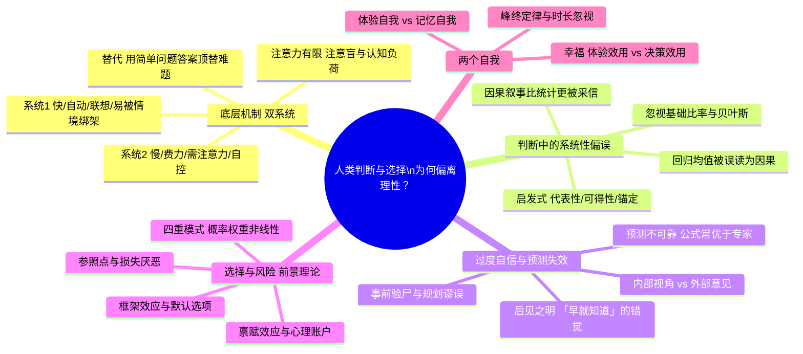

# 《思考，快与慢》读书分析

**作者**：丹尼尔·卡尼曼（Daniel Kahneman）  
**译者**：胡晓姣、李爱民、何梦莹

---

## 一、全书逻辑架构（内在逻辑思维导图）

本书在回答：**人如何做判断与选择、为何系统性地偏离理性**。下图按内在逻辑与演进线索组织，而非目录顺序。

```mermaid
mindmap
  root((人类判断与选择\n为何偏离理性？))
    底层机制 双系统
      系统1 快/自动/联想/易被情境绑架
      系统2 慢/费力/需注意力/自控
      替代 用简单问题答案顶替难题
      注意力有限 注意盲与认知负荷
    判断中的系统性偏误
      启发式 代表性/可得性/锚定
      忽视基础比率与贝叶斯
      回归均值被误读为因果
      因果叙事比统计更被采信
    过度自信与预测失效
      后见之明 「早就知道」的错觉
      预测不可靠 公式常优于专家
      内部视角 vs 外部意见
      事前验尸与规划谬误
    选择与风险 前景理论
      参照点与损失厌恶
      禀赋效应与心理账户
      框架效应与默认选项
      四重模式 概率权重非线性
    两个自我
      体验自我 vs 记忆自我
      峰终定律与时长忽视
      幸福 体验效用 vs 决策效用
```

---

## 二、逐章深度分析

### 引言

**【论证线索】**  
全书总纲：先抛出核心问题（人如何做判断与选择、为何偏离理性），再点明两条主线——双系统分工与偏见/偏误的机制；为后文「先建机制、再展偏误、再谈纠偏与自我」的论证顺序做铺垫。

**【核心议题】**  
本书的核心问题：人脑中有两套决策系统（系统 1 与系统 2），它们如何分工、何时出错，以及我们如何在与理性人假设不符的情况下做判断与选择。

**【关键概念】**  
**系统 1**：自动、快速、无需意志努力的思维模式，负责识别人脸、理解句子、直觉反应，易受情境与联想影响。**系统 2**：需要注意力与努力、可控制的思维模式，负责复杂运算、自我控制与理性推理，资源有限且具惰性。

**【关键证据/案例】**  
卡尼曼以自身研究与特沃斯基多年合作为主线，说明「快思考」自动、联想、易受情境影响，「慢思考」费力、需注意力；多数时候我们以为在理性思考，实则被系统 1 主导。

**【底层思维模型】**  
双系统模型（Dual-Process Theory）：系统 1 对应直觉与启发式，系统 2 对应有意识的推理与自控；二者协作与冲突构成了判断偏见的来源。

**【复盘思考】**  
在日常生活中，你能否举出一件「当时觉得理所当然，事后发现是直觉骗了你」的决定？如何设计一个简单机制，在重要决策前触发系统 2？

---

## 第一部分 两个系统

**本篇内在逻辑**：建立全书的**机制基础**——人脑有两种加工方式（系统 1 / 系统 2）。先界定两系统分工与冲突，再说明注意力有限导致「看不见」与惰性，接着展示系统 1 的联想、启动与流畅性如何左右判断，最后落到情境依赖与「用简单问题替代难题」的启发式。整体是从「谁在干活」到「何以出错」的递进。

### 第 1 章 一张愤怒的脸和一道乘法题

**【论证线索】**  
从日常现象（脸孔识别 vs 心算）切入 → 用瞳孔实验提供生理证据 → 确立两套加工方式及其冲突；本章是全书双系统概念的起点。

**【核心议题】**  
系统 1 负责自动加工（如识别人脸、理解句子），系统 2 负责需要集中注意力的任务（如复杂运算）；当系统 1 遇到困难时会求助系统 2，二者存在冲突与自我控制。

**【关键概念】**  
**认知负荷**：系统 2 参与时消耗的心理资源；负荷越高，瞳孔扩张等生理指标越明显，自我控制越易失败。

**【关键证据/案例】**  
第一步（现象）：看到愤怒的脸立刻产生情绪反应 vs 做 17×24 需心算与工作记忆，对应两种加工。第二步（机制证据）：**瞳孔与心算**——让被试做不同难度的乘法（2+2 vs 17×24），瞳孔直径随难度增大而扩张，支撑「系统 2 被激活」与认知负荷的可测性。

**【底层思维模型】**  
认知资源有限性：注意力是稀缺资源，系统 2 激活会抑制系统 1 的自动反应；自我控制本质是系统 2 对系统 1 的抑制。与 Ch.2–3 的注意局限、惰性共同构成「有限资源」链条。

**【复盘思考】**  
在疲劳或饥饿时，你是否更容易对他人发火或做出冲动决定？能否用「认知负荷」解释「又累又饿的法官更可能拒绝保释」？

---

### 第 2 章 电影的主角与配角

**【论证线索】**  
在已建立双系统的基础上，追问「系统 2 的注意力从何而来、有何局限」→ 用大猩猩实验证明注意像聚光灯、未照到即可能完全忽略 → 与 Ch.1 的瞳孔指标衔接，共同说明认知资源有限；为后文「为何会漏信息、为何会误判」埋下机制伏笔。

**【核心议题】**  
注意力像聚光灯，只能集中在有限信息上；未被注意的信息可能被完全忽略（如「看不见的大猩猩」），瞳孔变化可视为思维强度的生理指标。

**【关键概念】**  
**注意盲（inattentional blindness）**：当注意力集中在某任务时，未被注意的刺激（即使明显）可能完全不被觉察。**选择性注意**：认知资源像聚光灯，只加工被照到的信息，其余可能被系统 1 用连贯性「填补」成错觉。

**【关键证据/案例】**  
**看不见的大猩猩**：被试观看一段传球视频并专注数传球次数，期间一名穿大猩猩服装的人从画面中走过并稍作停顿，约半数人完全未注意到——注意力被数球任务占满，说明注意像聚光灯，未被照到的信息可能被完全忽略。瞳孔直径随心算难度增加而增大，也可作为认知努力的客观指标。

**【底层思维模型】**  
选择性注意与注意盲：我们以为在看「整幅画面」，实则只加工被注意的局部；系统 1 的连贯性会填补空白，制造「看见全部」的错觉。与 Ch.1 的认知资源有限、Ch.3 的惰性共同支撑「系统 2 有限 → 易漏信息、易误判」。

**【复盘思考】**  
结合本章「注意像聚光灯」：在关键会议或阅读时，你是否曾事后发现漏掉重要信息？能否用「注意分配」或清单在决策前主动补足？

---

### 第 3 章 惰性思维与延迟满足的矛盾

**【论证线索】**  
由「注意力有限」推进到「系统 2 的惰性」：资源耗尽时更不愿启动费力加工 → 保释官案例证明其现实后果（拒绝保释），简单/复杂题目对比说明系统 1 先反应、系统 2 后介入；与 Ch.1–2 形成「有限资源 + 惰性 = 易被系统 1 主导」的链条。

**【核心议题】**  
系统 2 具有惰性，不愿轻易启动；自我控制（如延迟满足）依赖系统 2，在认知资源被消耗（如疲劳、饥饿）时更容易失败。

**【关键概念】**  
**自我损耗（ego depletion）**：认知与情绪自控共用有限心理资源，资源被消耗（疲劳、饥饿、先前自控）后，系统 2 更不愿启动，直觉与冲动更易占上风。**系统 2 惰性**：系统 2 倾向于不介入，除非系统 1 遇到困难或主动调用。

**【关键证据/案例】**  
**保释官与用餐时间**：以色列保释官在临近午餐或下班前，更倾向于拒绝保释申请——并非案情不同，而是认知资源耗尽时更不愿做费力权衡，倾向于「维持现状」或直接否定，是系统 2 惰性的现实后果。「2+2=？」会直接得到 4，而复杂题目会让人「脱口而出错误答案」再修正，说明系统 1 先反应、系统 2 后介入。

**【底层思维模型】**  
自我损耗（Ego Depletion）的早期版本：认知与情绪自控共用有限资源，资源耗尽时直觉与冲动占上风。

**【复盘思考】**  
重要谈判或考核是否应避免安排在饭点前？你能否用「认知预算」来安排一天中需要深度思考的任务？

---

### 第 4 章 联想的神奇力量

**【论证线索】**  
从「谁在干活」转向「系统 1 如何干活」：联想与启动效应 → 用词语联想、铅笔与微笑等证据说明无关线索可无意识影响判断 → 建立「联想网络 + 启动」作为后续「流畅性」「情境依赖」的机制基础。

**【核心议题】**  
系统 1 通过联想自动激活相关概念与情绪；启动效应表明，无关线索（如词语、动作）会在无意识中影响后续判断与行为。

**【关键概念】**  
**启动效应（priming）**：先前的刺激（词语、动作、情境）会无意识地激活相关概念或情绪，从而影响后续判断与行为。**联想记忆网络**：概念以节点形式存储，激活某一节点会扩散到相关节点。**具身认知**：身体状态（如面部肌肉动作）通过联想影响情绪与判断。

**【关键证据/案例】**  
第一步（联想存在）：「香蕉」「呕吐」等词语联想会改变对后续信息的敏感度。第二步（启动与身体）：**铅笔与微笑**——用嘴含铅笔（类微笑）时觉得漫画更好笑，含笔尖（类噘嘴）则相反，支撑无关线索通过联想无意识影响判断，即启动效应与具身认知。

**【底层思维模型】**  
联想记忆网络：概念节点被激活后扩散到相关节点；启动自动、无意识却系统性改变判断。与 Ch.3 的惰性、Ch.5 的流畅性衔接：联想与启动是系统 1「容易加工」导致误判的机制基础。

**【复盘思考】**  
环境中的哪些「小线索」可能在不经意间影响你的情绪或判断？能否主动设计正向启动（如办公环境、开场问题）？

---

### 第 5 章 你的直觉有可能只是错觉

**【论证线索】**  
承接联想与启动，提出「流畅性」：加工越容易，越容易被当成真实或可能 → 股票代码等案例说明系统 1 把「容易想到」当成「更可能发生」→ 与 Ch.4 形成「联想 → 启动 → 流畅性误判」的递进，为第二部分的可得性、代表性等启发式做铺垫。

**【核心议题】**  
熟悉感、流畅感容易被误判为「正确」或「真实」；记忆中的易得性、情感强度会扭曲我们对概率与因果的判断。

**【关键概念】**  
**流畅性启发（fluency heuristic）**：加工越容易（易读、易记、易想），主观上越容易被判为「更真实、更可能、更可信」；系统 1 不区分「容易想到」与「真的更可能」。

**【关键证据/案例】**  
**股票代码与回报错觉**：股票代码上口、易发音的公司，被试会误判其未来回报率更高——熟悉感与流畅感被系统 1 误读为「更可靠、更可能好」，典型地把「容易加工」当成了「更可能发生」。容易想象或回忆的事件也被认为更可能发生；创新常出现在能激发联想、打破常规的环境中。

**【底层思维模型】**  
流畅性启发：加工越容易，主观真实感与信心越强；系统 1 不区分「容易想到」与「真的更可能」。与 Ch.4 联想与启动构成「系统 1 如何悄悄左右判断」的机制链，与第二部分可得性、代表性等启发式直接对应。

**【复盘思考】**  
紧扣流畅性：你最近一次「觉得很有把握」的判断，是否可能只是「想得很顺」？能否用「反流畅」检验（换表述、问相反问题）？

---

### 第 6 章 意料之外与情理之中

**【论证线索】**  
从单次判断推进到「叙事与记忆」：系统 1 会建构常态与因果故事，把意外事后合理化 → 引出后见之明与「眼见为实」的仓促结论；与 Ch.7 的情境依赖、Ch.8–9 的替代与启发式衔接，完成「系统 1 如何制造连贯却可能错的判断」这一逻辑块。

**【核心议题】**  
系统 1 会快速构建「常态」与因果叙事，将意外事件纳入「事后看来合理」的故事，从而高估自己事先的预测能力。

**【关键概念】**  
**常态理论（norm theory）**：我们不断更新内心对「正常」的参照，意外事件会被事后纳入「合理」叙事。**后见之明（hindsight bias）**：事后觉得「早就知道」，高估事前可预测性，记忆被事后信息污染。

**【关键证据/案例】**  
第一次遇到意外会惊讶，第二次类似事件则被纳入「常态」。眼见为实的倾向让我们过早下结论，忽略统计与基准信息。

**【底层思维模型】**  
常态理论（Norm Theory）：我们不断更新「正常」的参照；事后叙事会重构记忆，制造「我早就知道」的后见之明。

**【复盘思考】**  
复盘时，你是否常觉得「当时本该想到」？如何区分「事后合理化」与「事前本当能推理出来」？

---

### 第 7 章 字母「B」与数字「13」

**【论证线索】**  
同一刺激在不同情境下被解读成不同含义（B vs 13）→ 说明系统 1 自动「填满」语境、追求连贯 → 与 Ch.6 的叙事偏好衔接，并过渡到「我们用什么替代复杂问题」：连贯故事比统计更有说服力，为 Ch.8 的替代概念做铺垫。

**【核心议题】**  
情境（上下文）会强烈影响我们对同一刺激的解读；我们倾向于相信连贯的故事而非统计事实，光环效应与「眼见为实」会强化这种倾向。

**【关键概念】**  
**情境依赖**：同一刺激在不同上下文下被赋予不同含义（如 B vs 13），系统 1 自动「填满」合理解释。**光环效应**：对某人/事某一方面的印象会泛化到其他方面，强化连贯叙事、削弱统计信息权重。

**【关键证据/案例】**  
**字母 B 与数字 13**：同一形状，在「A B C」中被读成字母 B，在「12 13 14」中被读成数字 13——情境决定我们如何解读同一刺激，系统 1 自动填入「合理」含义，我们却以为自己在客观知觉。连贯叙述比零散数据更有说服力；群体在某些条件下能汇聚智慧，但在其他条件下会放大偏见。

**【底层思维模型】**  
情境依赖的知觉与判断：系统 1 追求连贯性，会主动「填满」语境；信念与偏好常被首因、光环等效应绑架。

**【复盘思考】**  
在做判断时，你是否曾因「故事讲得好」而高估其可信度？如何主动引入统计与反例来对冲叙事效应？

---

### 第 8 章 我们究竟是如何作出判断的？

**【论证线索】**  
正面提出「替代」机制：复杂问题被无意识地替换成简单问题，答案被直接当作原问题的答案 → 照片预测竞选等案例证明替代的普遍性 → 本章是「启发式」的总开关，与 Ch.9 的几种具体启发式（情感、立体等）形成总—分关系，并自然过渡到第二部分对各种启发式偏见的展开。

**【核心议题】**  
我们常通过「替代」用简单问题（如「这人看起来像赢家吗？」）的答案来回答复杂问题（如「谁更可能当选？」），替代过程多为无意识。

**【关键概念】**  
**替代（substitution）**：面对难以直接回答的目标问题时，系统 1 会无意识地用一个更容易的启发式问题来替代，并把得到的答案当作对原问题的回答，当事人往往浑然不觉。

**【关键证据/案例】**  
**照片预测竞选胜出者**：仅凭候选人照片预测谁将当选，准确率可达约 70%——并非长相决定治国能力，而是选民无意识地在回答「谁看起来更像领导人」这个更简单的问题，并把答案当作「谁更可能赢」，是替代的典型例证。平均长度与总长度也常被系统 1 混淆。

**【底层思维模型】**  
启发式与替代：目标问题难以直接回答时，系统 1 会找一个容易的问题来替代，并把答案当作对原问题的回答。

**【复盘思考】**  
你在评估人、项目或机会时，是否经常其实在回答另一个更简单的问题？如何显式列出「我真正要回答的问题」？

---

### 第 9 章 目标问题与启发性问题形影不离

**【论证线索】**  
在替代机制下，具体化为几类启发式：代表性、可得性、锚定；情感启发式用「喜不喜欢」替代「对不对」→ 为第二部分逐章展开各类偏误提供概念清单；本篇以「我们用什么简单问题替代难题」收束，与第二部分「这些替代会带来哪些系统性偏见」形成因果衔接。

**【核心议题】**  
三种典型启发式：代表性（像不像某类）、可得性（想不想得到）、锚定与调整；情感启发式则用「喜不喜欢」替代「对不对」。

**【关键概念】**  
**启发式（heuristic）**：用简单规则或局部线索替代复杂计算的省力策略；高效但易产生可预测的偏见。**代表性启发**：用「像不像某类」替代概率判断。**可得性启发**：用「想不想得到」替代客观频率。**锚定与调整**：从先呈现的数字或信息出发做不充分调整。**情感启发式**：用「喜不喜欢」替代「对不对」，情感线索取代理性判断。

**【关键证据/案例】**  
立体启发法：远处物体看起来更大（用空间直觉替代理性估计）。**情感启发式**：「因为喜欢，所以认同」——对某人或某方案有好感时，会更倾向认同其观点或可行性；反之，不喜欢则更容易挑刺；目标问题（这对吗？）被替换成启发式问题（我喜欢他/它吗？），理性让位于情感线索。

**【底层思维模型】**  
启发式是系统 1 的省力策略：用局部线索替代全局计算；高效但容易产生可预测的偏见。

**【复盘思考】**  
在做重要判断时，能否先写下「目标问题」和「我实际在用的启发式」，再检查二者是否一致？

---

## 第二部分 启发法与偏见

**本篇内在逻辑**：在双系统与启发式基础上，**逐类展开判断中的系统性偏误**。从小样本与随机性误读入手，经锚定、可得性、风险感知与政策，再到代表性、基础比率与合取谬误，最后以回归均值及对直觉预测的约束收束。整体是从「统计思维缺失」到「用基准与回归纠偏」的递进，并为第三部分过度自信与预测铺路。

### 第 10 章 大数法则与小数定律

**【论证线索】**  
从启发式进入「统计思维」的第一课：大数法则要求大样本才稳定，小样本波动大 → 人们却对小样本赋因果、编故事 → 建立「忽视随机性、高估规律性」的普遍偏见；与后文基础比率、回归均值形成「统计 vs 直觉」的一条连贯线。

**【核心议题】**  
统计规律只在大样本中稳定；小样本波动极大，但人们常对小样本过度解读，赋予因果意义，忽视随机性。

**【关键概念】**  
**大数法则**：统计规律只有在大样本下才稳定，小样本波动大。**小数定律（心理学）**：人们误把小样本当作有代表性的信号，对小样本赋因果、编故事，忽视随机性、高估规律性。

**【关键证据/案例】**  
第一步（规范标准）：大数法则要求大样本才稳定，小样本波动大（如连续几次正面），出错风险可高达 50%。第二步（偏误表现）：**小样本的错觉**——人们却对小样本过度解读、赋因果、对随机事件编故事，忽视随机性、高估规律性，「信任多于质疑」普遍存在。

**【底层思维模型】**  
大数法则 vs 小数定律：大数法则要求样本足够大才稳定；小数定律是心理学现象——人们误把小样本当作有代表性的信号。与 Ch.14–17 的基础比率、回归均值同属「统计思维 vs 直觉」线，为后续纠偏（基准、回归）做铺垫。

**【复盘思考】**  
你是否曾根据少量案例（如几次成功/失败）就总结出「规律」？如何设定「至少多少样本再下结论」的自律规则？

---

### 第 11 章 锚定效应在生活中随处可见

**【论证线索】**  
提出锚定机制：先出现的数字/信息成为锚，后续估计围绕其不充分调整 → 联合国比例等实验证明锚可任意、效应却稳定 → 与可得性（Ch.12）并列为本部分两种「信息如何被误用」的典型，为谈判、问卷等应用场景埋笔。

**【核心议题】**  
任意数字或信息一旦成为「锚」，会系统性拉高或拉低后续估计；对锚的调整往往不足，暗示本身即可制造锚定。

**【关键证据/案例】**  
第一步（锚可任意、效应稳定）：先问「联合国非洲国家比例是否高于 65%」再让估计，估计值明显高于先问「是否低于 10%」的组。第二步（应用）：谈判中的先出价、问卷中的默认值都是锚，说明锚定在生活中的普遍性。

**【底层思维模型】**  
锚定与不充分调整：系统 1 从锚出发做微调，而非从零开始重算；锚可以是完全无关的数字。与 Ch.9 启发式清单、Ch.12 可得性并列为本部分「信息被误用」的典型，与 Ch.8 替代（用简单问题顶替难题）机制一致。

**【复盘思考】**  
紧扣锚定：在报价、评估或规划时，谁在设定你的「锚」？能否主动引入多个锚或反锚（如从高和从低各估一次再取中）？

---

### 第 12 章 科学地利用可得性启发法

**【论证线索】**  
可得性启发：用「想起的容易程度」替代「客观频率或重要性」→ 近期新闻、身边案例会扭曲风险与概率判断 → 与 Ch.5 流畅性、Ch.11 锚定形成「三种典型启发式在本部分的展开」；点明「意识到偏见」可改善决策，为后文纠偏思路做铺垫。

**【核心议题】**  
「容易想到」会被当作「更常发生」或「更重要」；可得性受媒体、亲身经历、情绪影响；意识到这种偏见有助于改善团队沟通与自我认知。

**【关键证据/案例】**  
第一步（机制）：用「想起的容易程度」替代「客观频率或重要性」，近期新闻、身边案例会提高可得性从而高估风险或概率。第二步（纠偏）：意识到自己存在可得性偏见，能减少争执与误判，为后文纠偏思路做铺垫。

**【底层思维模型】**  
可得性启发：记忆与检索过程被多种因素污染，易得即被当作更常发生或更重要。与 Ch.5 流畅性（容易加工 → 误判）、Ch.11 锚定并列为本部分三种典型启发式；与 Ch.13 风险政策中「易得风险被放大」直接对应。

**【复盘思考】**  
你对某类风险或机会的判断，是否可能被最近看到的报道或故事扭曲？如何用统计数据校准可得性？

---

### 第 13 章 焦虑情绪与风险政策的设计

**【论证线索】**  
从个体偏误延伸到**风险感知与政策**：情绪会放大「可怕但罕见」的风险、忽视更大概率风险 → 闪电 vs 食物中毒等对比说明感知与统计脱节 → 与可得性、代表性结合，说明政策设计需兼顾情绪与概率；本章是「判断偏误」到「社会后果与政策」的过渡。

**【核心议题】**  
公众对风险的感知与统计概率严重脱节；情绪（如焦虑、恐惧）会放大某些低概率风险，影响政策与资源分配。

**【关键证据/案例】**  
被闪电击中与食物中毒的致死率对比：后者实际更高，但前者更易引发恐惧。小概率但骇人听闻的事件可能演变为公共危机，导致过度应对或忽视更大概率风险。

**【底层思维模型】**  
风险感知的双系统：情绪驱动对「可怕但罕见」事件的过度反应；理性更依赖概率与期望损失。政策需兼顾两者。与 Ch.12 可得性（易得风险被高估）、Ch.10 小样本与随机性同属「统计 vs 情绪」在风险政策中的体现。

**【复盘思考】**  
紧扣本章风险感知与政策：你所在组织是否曾因「一起极端事件」而改变整体策略？如何在本章双系统视角下平衡情绪安抚与基于概率的资源配置？

---

### 第 14 章 猜一下，汤姆的专业是什么？

**【论证线索】**  
代表性启发的经典展开：用「像不像某类」替代概率计算，忽视基础比率 → 汤姆猜职业案例说明典型性压倒基数 → 引入贝叶斯视角作为规范标准（先验 + 证据），与 Ch.10 小样本、Ch.15–16 合取与因果形成「何时该用统计思维」的递进。

**【核心议题】**  
人们依据「典型性」（像不像某类人）做预测，而忽视基础比率；贝叶斯定理要求结合先验（基础比率）与证据（典型性），可用来约束直觉。

**【关键证据/案例】**  
汤姆被描述为「内向、爱读书、喜欢秩序」——多数人猜他是图书馆员而非商人，尽管商人基数远大于图书馆员。典型性替代了概率计算。

**【底层思维模型】** 代表性启发 + 忽视基础比率：系统 1 用相似度代替概率；贝叶斯更新是规范模型，可用来校正直觉。

**【复盘思考】**  
在招聘或投资判断中，你是否过度依赖「像不像成功者」而忽视行业/赛道的基础成功率？如何显式使用基础比率？

---

### 第 15 章 琳达问题的社会效应

**【论证线索】**  
在代表性基础上推出**合取谬误**：更具体、更「像某类人」的描述反而被认为更可能，违背概率论（联言 ≤ 单言）→ 琳达问题成为代表性启发过度使用的标志性案例 → 与 Ch.14 形成「典型性 + 忽视基础比率 + 合取谬误」的代表性三部曲。

**【核心议题】**  
「琳达是银行出纳」与「琳达是关心女权问题的银行出纳」——联言（A 且 B）不可能比单言（A）更可能，但人们常违反这一逻辑，因为「更具体的故事」更符合代表性。

**【关键证据/案例】**  
琳达问题：多数人选「银行出纳且女权主义者」而非「银行出纳」，违背概率论（联言概率 ≤ 单言概率）。少即是多的逻辑悖论在社会层面广泛存在。

**【底层思维模型】**  
合取谬误：更详细、更「像某类人」的描述反而被认为更可能，因为系统 1 用代表性替代概率。

**【复盘思考】**  
你是否曾因某个描述「太具体、太像」而高估其真实性？如何用「少即是多」检验：去掉细节后概率应更高。

---

### 第 16 章 因果关系比统计学信息更具说服力

**【论证线索】**  
解释「为何基础比率常被忽视」：有因果故事的基础比率才会被采用，纯统计信息缺乏叙事吸引力 → 系统 1 偏爱因果连贯，统计思维需系统 2 刻意参与 → 与 Ch.14–15 共同完成「代表性 + 基础比率 + 因果叙事」的逻辑块，为 Ch.17 回归均值（另一种统计思维缺失）做铺垫。

**【核心议题】**  
有因果叙事的基础比率会被采用，纯统计的基础比率常被忽视；我们天生偏好因果思维，统计思维需要刻意训练。

**【关键证据/案例】**  
第一步（现象）：当基础比率被包装成「有原因」的故事时人们会采用，当它只是冷冰冰的统计时人们更依赖个案与典型性。第二步（机制）：系统 1 偏爱因果叙事、难以稳定采用统计型思维——与 Ch.14–15 的代表性、合取谬误共同说明「故事压倒统计」。

**【底层思维模型】**  
因果基率与思维定式：因果解释满足系统 1 对连贯性的需求；统计信息缺乏叙事，容易被忽略。与 Ch.6–7 的叙事与情境依赖、Ch.17 的回归被误读为因果同属「因果偏好」线。

**【复盘思考】**  
在决策时，你是否更愿意相信「因为 A 所以 B」的故事，而轻视「从统计上看 B 的概率是 X」？如何给统计信息赋予「可理解的因果」？

---

### 第 17 章 所有表现都会回归平均值

**【论证线索】**  
引入回归均值作为统计必然性：极端值后更可能出现较不极端值 → 教练批评/表扬被误读为有效，实为回归 → 与 Ch.10 随机性、Ch.16 因果偏好衔接，说明「把回归当因果」是判断偏误的重要一类；为 Ch.18 的预测回归（纠偏方法）做铺垫。

**【核心议题】**  
极端表现之后往往会向平均值靠拢，这不是因果，而是统计必然；人们却常把「第二次不如第一次」归因于批评或干预，产生因果幻觉。

**【关键证据/案例】**  
第一步（统计必然）：回归均值——任何带随机性的测量，极端值后更可能出现较不极端的值；卡尼曼称其意义不亚于发现万有引力。第二步（误读为因果）：教练在队员表现极好后批评、极差后表扬，会误以为批评/表扬「有效」，实则多为回归效应。

**【底层思维模型】**  
回归均值是统计必然，因果归因常将其误读为干预效果。与 Ch.10 随机性、Ch.16 因果叙事偏好形成「统计思维缺失」的又一表现；为 Ch.18 用回归约束预测（纠偏）做直接铺垫。

**【复盘思考】**  
你是否曾把「上次太好这次变差」归因于某人或某政策？能否先用「回归均值」做零假设，再考虑因果？

---

### 第 18 章 如何让直觉性预测更恰当有效？

**【论证线索】**  
从「偏误描述」转向「纠偏」：直觉预测常过度极端 → 用基准与回归约束可提高校准度 → 与 Ch.17 回归均值、第三部分「公式优于专家」「外部意见」形成「判断偏误 → 预测偏误 → 纠偏方法」的链条；本章是第二部分的收束，也是第三部分的引子。

**【核心议题】**  
直觉预测常过度极端（过于自信）；更恰当的做法是用统计规律向均值回归，或用简单公式替代纯直觉。

**【关键证据/案例】**  
偏离预测方向的直觉：直觉往往对极端情况过度反应。将预测向基准、向平均值拉回，能提高校准度。

**【底层思维模型】**  
预测校准：直觉需要被「回归」与「基准」约束；公式化预测在多数领域优于非结构化专家判断（为第三部分铺垫）。

**【复盘思考】**  
你的直觉预测是否经常「太极端」？能否为关键预测设定「基准 + 调整上限」的简单规则？

---

## 第三部分 过度自信与决策失误

**本篇内在逻辑**：在判断偏误与预测纠偏之后，聚焦**过度自信及其后果与纠偏**。从后见之明与「知道」的错觉切入，再论预测不可靠与公式优于专家、何时可信专家直觉，最后落到外部意见、规划谬误与事前验尸。整体是「偏误描述 → 何时信直觉 → 流程纠偏」的递进。

### 第 19 章 「知道」的错觉

**【论证线索】**  
从「预测偏误」进入**后见之明**：事后重构记忆，觉得「早就知道」→ 企业基业长青等案例说明社会成本 → 与 Ch.6 的事后叙事、Ch.20 的预测失效形成「事前不可知 vs 事后觉得可知」的对比，为第三部分定调。

**【核心议题】**  
后见之明让我们在事后觉得「早就知道」，高估事前可预测性；这种错觉会带来真实的社会成本（如过度问责、错误归因）。

**【关键证据/案例】**  
第一步（偏误表现）：企业基业长青的「秘诀」多为事后总结，难以事前复制。第二步（规范与成本）：对不确定性的无偏见评价要求承认「当时无法知道」，与后见之明本能相悖；该错觉带来过度问责、错误归因等社会成本。

**【底层思维模型】**  
后见之明偏差：记忆被事后信息污染，我们会重构「当时就知道」的叙事；真实决策应基于事前信息与概率。与 Ch.6 的事后叙事、Ch.20 的预测不可靠形成「事前不可知 vs 事后觉得可知」的完整表述。

**【复盘思考】**  
复盘时能否区分「当时已知」与「事后才明显」？能否用「事前记录理由」减少后见之明？

---

### 第 20 章 未来是不可预测的

**【论证线索】**  
正面论证预测的局限：专家预测常不优于随机或简单规则，反馈滞后、噪声大的领域难以校准直觉 → 与 Ch.19 后见之明形成「我们高估了可知性」的完整表述 → 为 Ch.21「公式优于专家」、Ch.22「何时可信直觉」提供前提（环境是否可预测、是否有反馈）。

**【核心议题】**  
许多领域的专家预测并不比随机或简单规则更准；在缺乏有效、及时反馈的环境中，技能无法通过经验可靠习得。

**【关键证据/案例】**  
专家预测准确度有时不如扔飞镖的猴子。股票预测不可靠。在结果滞后、噪声大、样本少的领域，直觉难以被校准。

**【底层思维模型】**  
可预测性取决于环境结构：只有规律稳定、反馈及时的环境，才适合发展专家直觉；否则应依赖统计与规则。

**【复盘思考】**  
你所在领域是「高反馈、高规律」还是「低反馈、高噪声」？这应决定你更信专家直觉还是更信算法/规则。

---

### 第 21 章 直觉判断与公式运算，孰优孰劣？

**【论证线索】**  
在「预测不可靠」的前提下，对比直觉与公式：简单线性模型常优于专家 → 专家难以稳定赋权、易受情境影响 → 与 Ch.18 基准+回归、Ch.20 环境反馈形成「何时用公式、何时用直觉」的决策规则；为 Ch.22 界定「可信直觉」的条件做铺垫。

**【核心议题】**  
在预测任务中，简单公式或统计模型往往优于专家综合判断；专家会受无关信息与主观偏好影响。

**【关键证据/案例】**  
大量研究表明：用少量关键变量构建的线性模型，预测表现稳定优于专家；专家难以稳定地给线索赋权。

**【底层思维模型】**  
机械预测 vs 临床判断：公式保证一致性与权重稳定；人类判断易受情境、顺序、情绪影响，但人们仍过度信任专家。

**【复盘思考】**  
你的关键决策是否已有「简单公式」版本？能否用历史数据做一个基准模型，再与直觉对比？

---

### 第 22 章 什么时候可以相信专家的直觉？

**【论证线索】**  
在 Ch.21「公式常优于专家」之后，界定例外：高规律性 + 充足反馈 + 长期训练 → 棋手、消防员等 vs 投资、诊断等对比 → 得到「环境决定直觉是否可练成」的结论；与 Ch.20–21 共同完成「预测与直觉」的逻辑块，并过渡到 Ch.23–24 的流程纠偏。

**【核心议题】**  
直觉「就在眨眼之间」，但只有环境有规律、且专家有大量高质量反馈时，直觉才可能被练成可靠技能。

**【关键证据/案例】**  
棋手、消防员等在规律明确、反馈及时的环境中能发展出有效直觉。医生诊断、投资选股等噪声大、反馈滞后，直觉易出错。

**【底层思维模型】**  
专家直觉的条件：高规律性 + 充足反馈 + 长期训练；不满足时，应降低对直觉的依赖。

**【复盘思考】**  
你自认的「专业直觉」所在领域，是否真的满足「规律稳定、反馈及时」？若不满足，如何用流程与数据补足？

---

### 第 23 章 努力养成采纳外部意见的决策习惯

**【论证线索】**  
从「何时信直觉」转向**如何用流程纠偏**：内部视角（个案叙事）vs 外部视角（基准与分布）→ 规划谬误普遍存在，外部意见可校准 → 与 Ch.18 基准回归、Ch.21 公式化形成「用统计与基准约束直觉」的实操版；为 Ch.24 事前验尸（另一纠偏手段）做铺垫。

**【核心议题】**  
我们天然偏向「内部意见」（基于当前案例的细节与故事），而忽视「外部意见」（同类案例的统计分布）；规划谬误普遍存在，采纳外部意见可减少过度乐观。

**【关键证据/案例】**  
规划谬误：项目时长、成本、难度普遍被低估。参考类似项目的历史分布（外部意见）能显著提高预估准确性。

**【底层思维模型】**  
内部视角 vs 外部视角：内部视角关注个案叙事，外部视角关注基准与分布；决策应主动引入外部视角。

**【复盘思考】**  
做计划时是否先查「同类项目通常要多久、花多少」？能否把「外部意见」设为必选步骤？

---

### 第 24 章 乐观主义是一柄双刃剑

**【论证线索】**  
乐观的适应性价值与代价 → 竞争忽视、规划谬误作为代价的具体表现 → 事前验尸作为流程化纠偏：假设失败、反推原因 → 与 Ch.23 外部意见共同收束本部分「过度自信 → 流程纠偏」的逻辑；为第四部分「选择与风险」（另一类偏误）做转折。

**【核心议题】**  
乐观主义推动行动与创新，但会导致过度自信、规划谬误与竞争忽视（如大片扎堆）；「事前验尸」等方法可部分克服乐观偏差。

**【关键证据/案例】**  
竞争忽视：创业者、制片人常忽视同类竞争，导致扎堆。事前验尸：假设项目已失败，反推可能原因，能提前暴露风险。

**【底层思维模型】**  
乐观偏差的适应性价值与代价；通过流程设计（如强制外部意见、事前验尸）对冲本能偏差。

**【复盘思考】**  
在启动新项目前，是否做过「事前验尸」？能否制度化「必须列出至少三个失败原因」？

---

## 第四部分 选择与风险

**本篇内在逻辑**：从判断与预测转入**选择与风险**——人在得失、概率前的系统性偏离。先摆明理性人假设失效并引入前景理论，再展开损失厌恶、禀赋效应、参照点与公平，以及概率权重与四重模式，最后到宽框架、心理账户与框架效应应用。整体是「期望效用失效 → 前景理论核心概念 → 应用与助推」的递进。

### 第 25 章 事关风险与财富的抉择

**【论证线索】**  
从判断偏误切换到**选择偏误**：理性经济人按期望效用决策的假设在现实中系统性地被违背 → 得失框架、参照点、概率权重都会改变选择 → 为 Ch.26 前景理论（价值函数、权重函数）的正式提出做铺垫；本章是第四部分的总起。

**【核心议题】**  
传统经济学假设理性经济人按期望效用决策；现实中人们系统性地违背该假设，需要更贴近心理的前景理论。

**【概念说明】**

- **期望效用决策**：传统经济学中的「理性人」假设——人在不确定下会先算每个结果的「概率 × 该结果的效用」，再选期望效用最大的选项；隐含假设是人对财富/结果的效用是线性的、对概率的权重也是线性的，即人是理性的期望值最大化者。
- **前景理论**：卡尼曼与特沃斯基提出的描述性理论，用来解释人在风险下**实际如何选择**。两大支柱为：（1）**价值函数**——以参照点为原点，损失带来的痛苦约是等额收益快乐的两倍（损失厌恶），且两端边际敏感度递减；（2）**概率权重函数**——人对概率的心理权重非线性，小概率被高估、接近 100%时被特别看重（确定性效应）。现实中人们系统性地违背期望效用（如更怕损失、对概率反应扭曲），故需用前景理论来贴近真实选择。

**【关键证据/案例】**  
面对风险与财富的抉择，人们并非一致地风险厌恶或风险寻求；得失框架、参照点、概率权重都会改变选择。

**【底层思维模型】**  
期望效用理论的局限；行为经济学用前景理论等模型描述真实选择。

**【复盘思考】**  
你能否回忆一次「在理性上该选 A，却选了 B」的决策？当时是什么框架或情绪在起作用？

---

### 第 26 章 更人性化的前景理论

**【论证线索】**  
正式建立前景理论：价值函数（参照点、损失厌恶、边际递减）与权重函数（概率非线性）→ 用损失厌恶约 2∶1、反射效应等证据支撑 → 与 Ch.25 形成「问题 → 模型」的完整链条，为 Ch.27–34 的禀赋、心理账户、框架等提供统一的理论底座。

**【核心议题】**  
前景理论用价值函数（参照点、损失厌恶、边际敏感度递减）和权重函数（对概率的非线性加权）替代期望效用，更符合人类选择。

**【关键证据/案例】**  
第一步（价值函数）：损失厌恶——等额损失带来的痛苦约 2 倍于等额收益的快乐；面对收益更避险、面对损失更冒险（**反射效应**：在收益域人们倾向风险规避、在损失域倾向风险寻求，偏好随参照点「反射」翻转）。第二步（与期望效用对比）：上述现象系统性地违背期望效用线性假设，支撑前景理论的两大构件（价值函数 + 权重函数）。

**【底层思维模型】**  
价值函数：以参照点为原点、损失侧更陡、两端边际敏感度递减；权重函数：小概率被高估、大概率被低估。与 Ch.25 形成「期望效用失效 → 前景理论」的完整链条，为 Ch.27–34 的禀赋、心理账户、框架等提供统一理论底座。

**【复盘思考】**  
紧扣损失厌恶与参照点：同一件事用「损失」还是「未得」表述，是否会改变你的选择？能否用「换框架」检验决策是否被表述绑架？

---

### 第 27 章 禀赋效应与市场交易

**【论证线索】**  
从前景理论推出**禀赋效应**：所有权改变参照点，拥有即提高主观价值 → 马克杯等实验证明买卖价差 → 与损失厌恶、参照点结合，说明「像商人那样交换思维」可减轻禀赋效应；为 Ch.28 公平性（另一类参照点）做铺垫。

**【核心议题】**  
拥有某物会提高其主观价值，导致「不愿割舍」；像商人那样用机会成本思考（而非沉没成本）可减轻禀赋效应。

**【关键证据/案例】**  
人们对自己拥有的东西要价高于自己愿意为同类东西付的价。商人更习惯「交换」思维，禀赋效应较弱。

**【底层思维模型】**  
禀赋效应：所有权改变参照点与价值感知；与损失厌恶结合，导致买卖价差与现状偏见。

**【复盘思考】**  
你是否曾因「已经拥有」而拒绝一个客观上更优的交换？能否用「若一开始没有，我会买吗？」来检验？

---

### 第 28 章 经济交易的参照点——公平性

**【论证线索】** **参照点**从财富扩展到**公平**：目标、现状、社会比较都可成为参照 → 损失框架（被剥夺）比收益框架更易引发不满 → 与 Ch.26–27 形成「价值函数 + 禀赋 + 公平参照点」的逻辑块，为 Ch.29 概率权重（四重模式）做转折。

**【核心议题】**  
人们用「公平」作为交易与分配的参照点；对偏离公平（如提价、降薪）的厌恶会触发强烈反应，甚至放弃互利交易。

**【关键证据/案例】**  
商人提价或降薪常被视为不公平，即便在供需变化下。之所以如此，是因为人们在判断「公不公平」时，会拿多个东西当**参照点**：例如原来的价格/薪水（现状）、自己心里的预期（目标）、别人现在拿多少或别处怎么做（社会比较）。只要实际结果落在这些参照点之下，就容易被主观评为「被占便宜」「被剥夺」，从而触发强烈的不公平感。

**【底层思维模型】**  
公平性作为参照点：损失框架（被剥夺）比收益框架（未获得）更易引发不满；制度设计需考虑公平感。

**【复盘思考】**  
在制定价格或薪酬政策时，是否显式考虑「参照点」与「公平叙事」？如何在不违背效率的前提下减少公平感冲击？

---

### 第 29 章 对结果可能性的权衡

**【论证线索】** 从价值函数转向**权重函数**：概率被非线性加权，小概率高估、确定性效应 → 四重模式（收益/损失 × 高/低概率）概括组合行为 → 与 Ch.26 权重函数呼应，为 Ch.30 罕见事件的双重扭曲（高估或忽视）提供机制解释。

**【核心议题】**  
人们对概率的权重不是线性的：小概率被高估（可能性效应），高概率与确定性被特别对待（确定性效应）；四重模式概括了收益/损失 × 概率高/低的组合行为。

**【概念说明】**  
**四重模式**（收益/损失 × 概率高/低）指前景理论下，人在四种情境中的典型风险态度：  
| | 高概率 | 低概率 | | --- | --- | --- | | **收益** | 风险规避（宁要确定的收益，不赌更大的） | 风险寻求（如买彩票：小概率博大奖） | | **损失** | 风险寻求（宁肯赌一把，也不接受确定损失） | 风险规避（如买保险：付小钱避免小概率大损失） |

**【关键证据/案例】**  
著名决策理论家也会在简单题目上犯错，说明偏误深植于系统 1。买彩票（小概率大收益）与买保险（小概率大损失）对应四重模式的不同象限。

**【底层思维模型】**  
权重函数 π(p)：p 小则 π(p) > p（可能性效应），p 大则 π(p) < p；确定性效应使 100% 与 99% 在心理上差距巨大。

**【复盘思考】**  
你的风险决策是否常被「几乎确定」或「万一」主导？能否用四重模式画出自己的选择，检查是否一致？

---

### 第 30 章 被过分关注的罕见事件

**【论证线索】** 在四重模式与权重函数下，**罕见事件**被双重扭曲：有时被高估（可能性效应+可得性），有时被忽视（长序列中的分母忽视）→ 恐怖袭击保险等例子说明情境依赖 → 与 Ch.29 形成「概率权重 → 罕见事件应用」的衔接，为 Ch.31 宽框架（纠偏思路）做铺垫。

**【核心议题】**  
罕见事件有时被过度关注（如恐怖袭击保险），有时被忽视（如慢性风险）；关注度受情绪、媒体、可得性影响。

**【关键证据/案例】**  
你该买恐怖袭击保险吗？——概率极低但易被想象的事件会扭曲保险与政策选择。反之，某些低概率但高损失的风险又常被忽视。

**【底层思维模型】**  
罕见事件的双重扭曲：一方面被高估（可能性效应 + 可得性），一方面在长序列中被忽视（分母忽视）；需区分情境。

**【复盘思考】**  
你最近一次为「极小概率」付费或担心，是否经得起「期望损失」的检验？反之，是否忽视了某个低概率大损失？

---

### 第 31 章 能带来长远收益的风险政策

**【论证线索】** 提出**框架宽度**作为纠偏：窄框架放大损失厌恶，宽框架平滑波动、更接近理性 → 「不要每天看行情」等应用 → 与 Ch.26 损失厌恶、Ch.30 罕见事件形成「偏误 → 框架纠偏」的链条；为 Ch.32 心理账户（另一类框架）做铺垫。

**【核心议题】**  
窄框架（每次决策单独看）会放大损失厌恶；宽框架（把多次决策当作一个组合）能平滑波动，更接近理性期望。

**【关键证据/案例】**  
聪明的投资者不会每天都看股票——频繁查看会激活窄框架与损失厌恶。风险政策（如定投、分散、长期视角）可抵消部分偏见。

**【底层思维模型】**  
框架宽度：单次 vs 序列；宽框架下，统计规律更明显，情绪波动更小。

**【复盘思考】**  
你是否因「每天看账户」而做过冲动操作？能否设定「只在固定周期做组合级复盘」的规则？

---

### 第 32 章 心理账户是如何影响我们的选择的？

**【论证线索】** 在参照点与框架下引入**心理账户**：金钱被分账户、非替代性 → 卖盈持亏、沉没成本等行为得到解释 → 与禀赋效应、损失厌恶结合，说明「总财富视角」与「分账户视角」的冲突；为 Ch.33 评估模式、Ch.34 框架效应应用做铺垫。

**【核心议题】**  
人们把金钱与结果归入不同「心理账户」，不同账户有不同的参照点与风险态度；卖盈持亏等行为可用心理账户解释。换句话说，虽然在账面上所有钱都是「同一种货币」，但在心理上会被分成「工资」「奖金」「本金」「赚来的钱」等不同格子：在「本金账户」里，人们通常更保守，在「盈利/奖金账户」里则更敢花、更敢赌，这种账户标签会系统性影响我们的选择。

**【关键证据/案例】**  
你会卖掉盈利的股票还是亏损的？——许多人卖盈持亏，因为「盈利账户」要锁定收益，「亏损账户」要等回本。沉没成本悖论也常与心理账户绑定。

**【底层思维模型】**  
心理账户：非替代性、非 fungible；与禀赋效应、损失厌恶结合，导致与总财富最大化不一致的选择。

**【复盘思考】**  
你的消费与投资是否被「这是奖金」「这是本金」等账户标签影响？能否尝试「只有一个总账户」的思维实验？

---

### 第 33 章 评估结果的逆转

**【论证线索】** 偏好随**评估模式**变化：综合评估 vs 单独评估会导致偏好逆转 → 同类案件判决差异等说明参照系与比较对象的作用 → 与框架效应、心理账户形成「呈现方式如何影响选择」的逻辑块；为 Ch.34 善用框架（选择架构与助推）做铺垫。

**【核心议题】**  
综合评估（一起比）与单独评估（分开看）会引发偏好逆转；同一选项在不同评估方式下可能输赢对调。

**【关键证据/案例】**  
同类案件相继出现，判决结果却不同——因为并排比较改变了参照系。综合评估时人们更关注可比较维度，单独评估时更关注情感与故事。

**【底层思维模型】**  
评估模式依赖：偏好不是稳定的，而是随评估框架、比较对象、呈现顺序变化；设计选择架构可引导偏好。

**【复盘思考】**  
你的「更喜欢 A 还是 B」是否可能因「先看谁、和谁比」而改变？重要决策是否应换多种评估方式检验？

---

### 第 34 章 善用框架效应，让生活更美好

**【论证线索】** 从「描述偏误」转向**应用**：默认选项、表述、顺序可被设计（选择架构）→ 器官捐献等案例说明助推的正当应用与伦理边界 → 与 Ch.26–33 形成「前景理论 → 各类偏误 → 框架与助推」的收束；为第五部分「两个自我」（谁在体验、谁在决策）做转折。

**【核心议题】**  
框架效应可被主动运用：默认选项、表述方式（损失 vs 收益）、选项顺序都能系统性影响选择；可用来助推政策与公益。

**【关键证据/案例】**  
器官捐献率在「默认同意」国家远高于「默认拒绝」国家。用框架性方案助推政府出台政策、提高公益参与，是行为洞察的正当应用。

**【底层思维模型】**  
选择架构（Choice Architecture）：设计者通过框架与默认项影响行为，同时保留选择自由；伦理上需透明与审慎。

**【复盘思考】**  
你设计的产品或流程中，默认项和表述是否在无意识地推动某种选择？如何既善用框架又避免操纵？

---

## 第五部分 两个自我

**本篇内在逻辑**：在判断与选择偏误之后，追问**谁在体验、谁在决策**——体验自我与记忆自我的分裂。从决策效用与体验效用不一致，到峰终定律与时长忽视，再到幸福的双重含义与测量困境。整体是「两个自我 → 记忆改写体验 → 幸福概念澄清」，收束于「人并非单一理性主体」。

### 第 35 章 体验效用与决策效用的不一致

**【论证线索】** 从「选择偏误」切换到**自我分裂**：决策时预期的效用与事后体验的效用常不一致 → 记忆与叙事会改写体验 → 建立「体验自我 vs 记忆自我」的区分，为 Ch.36 峰终定律（记忆如何被峰值与结尾主导）、Ch.37–38 幸福测量做铺垫；本章是第五部分的总起。

**【核心议题】**  
我们做决策时预期的效用（决策效用）与事后实际体验的效用（体验效用）常不一致；记忆与叙事会改写体验。

**【关键证据/案例】**  
如何测量体验效用？——需要区分「当下体验」与「事后回忆」；二者受不同规律支配。

**【底层思维模型】**  
体验自我 vs 记忆自我：体验自我活在当下，记忆自我负责叙事与决策；许多选择是在满足记忆自我而非体验自我。与第四部分框架效应、参照点衔接——「谁在决策」从判断与选择延伸到「谁在体验、谁在回忆」，与 Ch.36–38 的峰终、幸福测量形成本部分完整逻辑。

**【复盘思考】**  
紧扣两个自我：你曾否为「回忆起来会很好」而牺牲「过程其实一般」？如何在本章区分下平衡「过程体验」与「结局记忆」？

---

### 第 36 章 人生如戏

**【论证线索】** 在体验 vs 记忆的框架下，提出**峰终定律与时长忽视**：记忆由峰值与结束时刻主导，时长权重很低 → 旅行等例子说明「更好的故事」未必是「更好的体验」→ 与 Ch.35 形成「谁在决策、谁在回忆」的机制展开，为 Ch.37–38 幸福与生活满意度（记忆自我的判断）做铺垫。

**【核心议题】**  
我们更在意「人生的结局」和关键片段的峰值与结尾，而非过程总时长；记忆会突出峰值与终了，忽略时长（峰终定律、时长忽视）。

**【关键证据/案例】**  
关于上一次旅行，你还能想起什么？——多是高潮与结尾；长时间但平淡的旅行在记忆中的评价可能低于短而精彩的旅行。

**【底层思维模型】**  
峰终定律（Peak-End Rule）：体验的评价由峰值与结束时刻主导；时长忽视（Duration Neglect）：时长在记忆中权重很低。

**【复盘思考】**  
你是在为「更好的体验」还是「更好的故事」做选择？若重视体验自我，是否应减少对「结局」的过度优化？

---

### 第 37 章 你有多幸福？

**【论证线索】** 「幸福」有双重含义：体验层面的情绪 vs 评价层面的生活满意度 → 二者受不同因素影响、且难以稳定测量 → 与 Ch.35–36 形成「体验自我 vs 记忆自我在幸福问题上的对应」；为 Ch.38 生活满意度的困难与错觉做铺垫。

**【核心议题】**  
幸福既可指当下的体验效用，也可指对生活的整体评价；二者相关但不一致，且都难以稳定测量。

**【关键证据/案例】**  
幸福是种需要随时进行的测量——经验自我的幸福感和生活满意度（记忆自我）受不同因素影响；收入、健康、社会比较的作用复杂。

**【底层思维模型】**  
幸福的双重含义：体验层面的情绪与评价层面的生活满意度；政策与个人目标需明确在追求哪一种。

**【复盘思考】**  
你追求的「幸福」更多是「每天感觉不错」还是「回顾人生觉得值得」？两者冲突时你如何取舍？

---

### 第 38 章 思考生活

**【论证线索】** 生活满意度作为记忆自我的判断，易受情境与可得信息影响 → 幸福错觉与自我报告的不透明 → 与 Ch.35–37 共同完成「两个自我 + 幸福测量」的逻辑块，为结语「双系统与两个自我如何整合」做铺垫。

**【核心议题】**  
「生活满意度」是一个很难回答的问题，容易受当前情境与可得信息影响；被放大的幸福错觉提醒我们：我们对自身的判断并不透明。

**【关键证据/案例】**  
生活满意度问卷的答案会被天气、刚才发生的小事影响。我们常高估或低估自己的幸福，且难以准确归因。

**【底层思维模型】**  
自我报告的局限：记忆自我在建构「我有多幸福」时依赖叙事与线索，易受框架与情境影响。

**【复盘思考】**  
在评估自己的整体状态时，是否被最近一两件事主导？能否用「多时刻采样」或「多维度拆解」减少单次自评的噪声？

---

## 结语

**【论证线索】** 全书收束：双系统（谁在判断与选择）与两个自我（谁在体验、谁在回忆）并非同一套逻辑 → 承认这些机制是改进决策与政策的第一步；与引言呼应，形成「问题 → 机制与偏误 → 纠偏与自我 → 整合视角」的闭环。

**【核心议题】**  
两个自我（体验自我与记忆自我）的区分，以及双系统（系统 1 与系统 2）的协作与冲突，共同构成理解人类判断与选择的基础；承认这些机制是改进决策与政策的第一步。

**【关键证据/案例】**  
全书贯穿的实验与现象都可归结为：我们是谁、我们如何选、我们如何回忆，并非同一套逻辑。

**【底层思维模型】**  
整合框架：双系统 + 启发式与偏见 + 前景理论 + 两个自我；描述性（人如何做）先于规范性（人该如何做）。

**【复盘思考】**  
读完本书后，你会在哪一类决策中首先引入「慢思考」或「外部意见」？你愿意接受「记忆自我会骗人」从而更关注体验自我吗？

---

## 三、核心知识库

### 金句库

> 我们总是高估自己对世界的了解，却低估了机遇在其中的作用。

> 当你对答案不确定时，跟着你的直觉走——但不要以为你知道答案。

> 核心思想：没有什么比发现自己的错误更令人沮丧，但也没有什么比承认自己错了更能让人成长。

> 核心思想：我们无法完全避免偏见，但我们可以学会识别它们，并在重要决策时引入纠错机制。

> 生活满意度是一个很难回答的问题，我们对自己的判断并不像我们以为的那样透明。

> 回归平均值现象的意义不亚于发现万有引力。

> 核心思想：在缺乏有效反馈的环境下，技能无法通过经验可靠习得——可预测性取决于环境结构。

> 核心思想：你是在为「更好的体验」还是「更好的故事」做选择？体验自我与记忆自我并非同一套逻辑。

### 行动清单

- [ ] **重要决策前强制「冷静期」**：至少隔一夜再定，让系统 2 参与，减少冲动与锚定。
- [ ] **做计划时先查外部基准**：同类项目/任务通常要多久、花多少，再结合当前案例调整，避免规划谬误。
- [ ] **对关键预测做「基准 + 回归」**：先给出基础比率或历史均值，再根据新信息做有限调整，避免极端预测。
- [ ] **重大项目前做「事前验尸」**：假设已失败，列出最可能的原因与应对，提前暴露乐观偏差。
- [ ] **用「换框架」检验选择**：同一决策用收益/损失、单独/综合各表述一遍，看偏好是否稳定，识别框架效应。

### 术语表

| 术语 | 定义 |
| --- | --- |
| **系统 1** | 自动、快速、无需意志努力、联想式的思维模式，易受情境与启发式影响。 |
| **系统 2** | 需要注意力、慢速、可控制、逻辑式的思维模式，负责复杂计算与自我控制。 |
| **启发式** | 用简单规则或局部线索替代复杂计算的认知策略，高效但易产生系统性偏见。 |
| **锚定效应** | 先呈现的数字或信息成为「锚」，使后续估计系统性偏向该锚，调整往往不足。 |
| **期望效用（决策）** | 传统经济学假设：人在不确定下按「各结果概率 × 该结果效用」算期望效用，并选择期望效用最大的选项；隐含效用与概率均为线性，人是理性的期望值最大化者。现实中人们常系统性违背该假设。 |
| **损失厌恶** | 等额损失带来的负效用大于等额收益带来的正效用，约 2∶1。 |
| **禀赋效应** | 拥有某物会提高其主观价值，导致不愿交换或要价高于愿付价格。 |
| **前景理论** | 卡尼曼与特沃斯基提出的描述性理论，用以描述人在风险下**实际如何选择**（非「应该如何」）。两大支柱：（1）**价值函数**——以参照点为原点，损失厌恶、两端边际敏感度递减；（2）**概率权重函数**——小概率被高估、确定性效应等非线性权重。替代期望效用，更贴近真实选择。 |
| **反射效应** | 前景理论中的现象：在**收益域**人们倾向风险规避（如选「确定拿到 100」而非「50% 拿 200」），在**损失域**倾向风险寻求（如选「50% 亏 200」而非「确定亏 100」）；偏好随参照点「反射」翻转，与价值函数在收益侧凹、损失侧凸对应。 |
| **四重模式** | 前景理论中「收益/损失 × 概率高/低」的四种组合及对应风险态度：收益+高概率 → 风险规避，收益+低概率 → 风险寻求（如彩票），损失+高概率 → 风险寻求，损失+低概率 → 风险规避（如保险）。由可能性效应与确定性效应共同产生。 |
| **心理账户** | 人们将金钱或结果归入不同心理类别，不同账户有不同参照点与风险态度。 |
| **峰终定律** | 对一段体验的评价主要由「峰值」与「结束时刻」决定，而非总时长。 |
| **回归均值** | 极端观测值之后更可能出现较不极端的值，是统计规律而非因果效应。 |
| **事前验尸** | 假设项目/决策已失败，反推可能原因，用于克服乐观偏差与规划谬误。 |

---

## 四、批判性思考

### 理论的局限性

1. **双系统是隐喻而非解剖**  
   系统 1/系统 2 是功能划分，不对应大脑中两个固定区域；多系统、连续加工等模型同样有证据。过度依赖「两个系统」的叙事，可能简化了认知的连续性与情境依赖性。

2. **多数证据来自实验室与西方样本**  
   许多经典实验在受控情境下完成，且被试多为西方、受教育人群。启发式与偏见的强度、类型在不同文化、不同领域可能不同；应用时需结合情境做校准，而非直接照搬。

3. **描述多、处方少**  
   本书长于揭示「人如何出错」，对「如何系统性地改」着墨相对少。个人层面的「慢下来」「用清单」可行，但组织与制度如何嵌入行为洞察、如何避免「助推」沦为操纵，仍需更细的规范与实践。

4. **两个自我与幸福的可操作化不足**  
   体验自我与记忆自我的区分富有洞见，但如何测量、如何在不同目标间权衡（过程幸福 vs 结局满意），仍缺乏统一框架；政策若以「幸福」为目标，需先明确定义与指标。

### 在当今环境下的新应用可能

1. **产品与界面设计**  
   默认选项、选项顺序、损失/收益表述、锚定值（如价格展示）都可基于前景理论与框架效应做设计；同时需透明与伦理审查，避免暗黑模式。

2. **AI 与算法决策**  
   人类偏见可被算法复制（训练数据与目标函数中的偏差）；反之，算法可提供「外部意见」与基准预测，约束直觉。人机协作的关键在于明确：何时以算法为主、何时以人类 override，以及如何审计算法中的行为偏见。

3. **政策与制度**  
   从养老金默认选项、环保行为助推，到司法与医疗中的清单与统计辅助，行为洞察已广泛进入公共政策；下一步是建立「何时用助推、何时用强制、如何评估长期效果」的规范，并纳入公众讨论。

4. **自我与组织复盘**  
   用「事前记录理由」「外部基准」「事前验尸」改造复盘会，可减少后见之明与叙事扭曲；把「两个自我」引入目标设定，可区分「过程体验」与「结局故事」，更理性地分配时间与资源。
