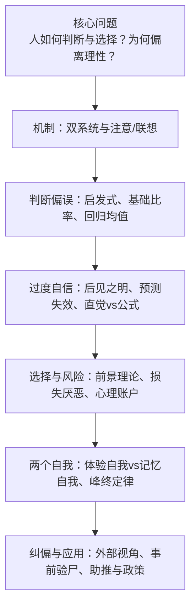
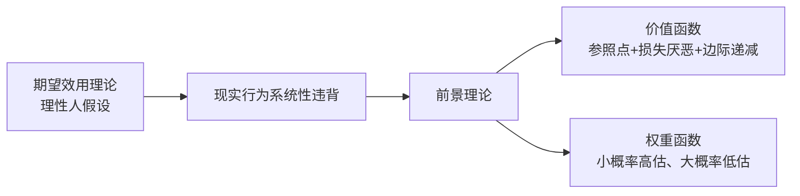

---
### 第 1 页：《思考，快与慢》——如何看清我们的判断与选择

**页面要点**
- 这本书在回答：人类为何系统性偏离理性？
- 双系统：系统 1（快直觉）+ 系统 2（慢理性）
- 偏误不是例外，而是机制带来的必然
- 目标：用一条逻辑线，讲清「问题→机制→偏误→纠偏→两个自我」

**本页图示/表格**

| 关键词 | 含义 |
| --- | --- |
| 判断 | 我们如何看世界、下判断 |
| 选择 | 我们如何做决策、选方案 |
| 偏离理性 | 系统性错误，而非偶然失误 |

**讲稿正文**
这本书要回答的，是一个看似简单却极难的问题：**人类是如何做判断与选择的，为什么会系统性地偏离理性？**作者卡尼曼用一整本书，在解剖我们大脑里的两套系统，以及它们如何在不知不觉中带来偏误。\n
全书的主角是两套思维系统：**系统 1** 是快、自动、联想驱动的直觉；**系统 2** 是慢、费力、需要注意力的理性推理。多数时候，我们以为自己在理性思考，其实是系统 1 在前台表演，系统 2 只是偶尔介入纠错。\n
接下来，我们会沿着一条主线来讲这本书：从核心问题出发，先看大脑的双系统机制，再看它如何制造判断偏误与过度自信，接着走到前景理论下的风险选择，最后落到两个自我与幸福，以及我们能做的实际纠偏与行动。
---

### 第 2 页：全书主线——从双系统到两个自我

**页面要点**

- 核心问题：判断与选择为何偏离理性？
- 机制层：双系统与注意/联想
- 表现层：启发式与判断偏误、过度自信与预测失效
- 决策层：前景理论与风险选择
- 自我层：两个自我与幸福
- 行动层：如何纠偏与设计更好的决策环境

**本页图示/表格**

**讲稿正文** 如果用一张图来概括全书的逻辑，可以看成从**机制 → 表现 → 决策模型 → 自我 → 行动**的五层结构。\n 第一层，是**机制**：双系统如何分工，注意力为何有限，联想与流畅性如何驱动系统 1 的自动反应。第二层，是这些机制在判断中的**表现**：代表性、可得性、锚定等启发式，以及小样本误读、忽视基础比率、把回归当因果的一整串偏误。\n 第三层，是在不确定性和风险下的**选择模型**：为什么期望效用理论失效，前景理论如何用参照点、损失厌恶和概率权重，更贴近真实人。第四层，是**两个自我**——体验自我和记忆自我——它们以不同的规则评价人生。最后一层，是**行动与应用**：从外部视角、事前验尸到风险政策和行为助推，我们如何在承认偏见的前提下，设计更好的决策与制度。

---

### 第 3 页：双系统机制——谁在帮你思考？

**页面要点**

- 系统 1：快、自动、联想驱动，负责直觉判断
- 系统 2：慢、费力、需要注意力，负责计算与自控
- 认知资源有限：系统 2 稀缺且惰性
- 多数时候，是系统 1 在「代你做决定」

**本页图示/表格**

| 特征     | 系统 1（快思考）       | 系统 2（慢思考）             |
| -------- | ---------------------- | ---------------------------- |
| 速度     | 快、自动               | 慢、刻意思考                 |
| 资源消耗 | 几乎不费力             | 需要注意力与精力             |
| 典型任务 | 识别表情、完成熟练动作 | 复杂运算、逻辑推理、自我控制 |
| 风险     | 易受情境与启发式绑架   | 容易偷懒、不愿长期介入       |

**讲稿正文** 卡尼曼用一张愤怒的脸和一道乘法题，把大脑里的两套系统讲得非常直观：看到愤怒的脸，你几乎瞬间能感到对方的情绪；而算出 17×24，却需要你停下来、调动注意力、在心里演算。这就是**系统 1** 和 **系统 2** 的分工。\n **系统 1** 是快、自动、联想驱动的：它可以瞬间识别人脸、理解常见语句、对环境变化做出本能反应。**系统 2** 则是慢、费力、需要注意力的：只有在做心算、复杂推理、压抑冲动时，它才真正「上线」。\n 关键在于：系统 2 的资源是有限且惰性的。瞳孔实验显示，当我们在做难题时，瞳孔会放大，说明系统 2 正在消耗资源；在疲劳或饥饿时，它更不愿出手。这意味着，大部分日常判断，其实是系统 1 在代劳，我们的「理性」常常是事后包装出来的故事。

---

### 第 4 页：注意力、惰性与「看不见的大猩猩」

**页面要点**

- 注意力像聚光灯：照到的才被加工
- 「看不见的大猩猩」：注意盲的经典实验
- 系统 2 资源有限 + 惰性 → 易放任系统 1
- 决策质量受状态影响：又累又饿时更冲动、更保守

**讲稿正文** 在双系统的框架下，作者进一步用「看不见的大猩猩」实验，说明**注意力的极端有限**。当被试专注于数球时，即便有一只大猩猩从画面中间走过，约一半的人完全没看到——说明未被注意的刺激，几乎等于不存在。\n 这时再结合瞳孔与心算实验，我们就能看见：**系统 2 的注意资源既稀缺又昂贵**。当它被某个任务占满时，其他信息就进不了门；当它疲惫、饥饿、负荷过重时，又会变得格外吝啬，不愿意启动。\n 现实后果非常具体：以色列保释官在临近午餐或下班前，更倾向于拒绝保释申请，并非案件不同，而是他们此时更不愿意启动系统 2 去认真权衡。于是，系统 1 的「维持现状」「保守否决」就顺理成章地占了上风。

---

### 第 5 页：联想与流畅性——直觉的「顺畅感」如何骗你

**页面要点**

- 系统 1 通过联想网络自动激活相关概念
- 启动效应：无关线索也能改变判断
- 流畅性：越容易加工，越容易被当成真实
- 熟悉感 ≠ 真实，顺畅感 ≠ 正确

**讲稿正文** 接下来，作者转向系统 1 的「工作方式」：**联想与流畅性**。看到「香蕉」这个词，你脑中会自动联想到「黄色」「水果」甚至「猴子」；看到「呕吐」，你会产生一种轻微的厌恶感。这些都是联想网络在后台自动运转。\n 经典的**铅笔与微笑**实验表明：只要让人用嘴含着铅笔，做出类似微笑的肌肉动作，被试就会觉得漫画更好笑；如果让他们用嘴唇夹住笔尖，做出类似噘嘴的动作，评价就会变差。身体姿态这种看似微不足道的线索，居然能通过启动效应改变情绪与判断。\n 更隐蔽的是**流畅性错觉**：我们往往把「读起来顺、想起来快」误判为「更真实、更可能」。诸如易读的股票代码，容易被认为更靠谱；熟悉的观点，更容易被当成真实。这为后续的**可得性启发**和「媒体如何扭曲我们对风险的感知」埋下了伏笔。

---

### 第 6 页：从联想到启发式——我们如何用简单问题替代难题

**页面要点**

- 系统 1 追求连贯故事，而非严格推理
- 遇到难题时，会无意识用简单问题替代
- 代表性、可得性、锚定：三大启发式
- 行为表面「合理」，本质是偷懒的替代机制

**讲稿正文** 当我们面对一个复杂、模糊、信息不足的问题时，大脑并不会老老实实算完所有概率与期望，而是会**偷偷换题**。这就是本书反复强调的「替代」机制：系统 1 会用一个更容易的问题来代替原始问题。\n 例如，选民在面对「谁更适合当总统？」这种复杂问题时，往往会退化为「谁看起来更像领导？」；评估一个项目的风险时，我们会从「这类项目以前出过什么大新闻？」这样的可得性线索出发。我们以为自己在回答原问题，实际上在回答一个简单得多的替代问题。\n 在这种替代机制下，便产生了书中大名鼎鼎的三大启发式：**代表性**（像不像某类）、**可得性**（想不想得到）、**锚定**（先出现的数字把你「定住」）。它们高效、省力，却系统性地把我们带离理性。

---

### 第 7 页：判断偏误 I ——小数定律、锚定与可得性

**页面要点**

- 大数法则 vs 小数定律：小样本波动大
- 锚定效应：任意数字都能把你「定住」
- 可得性启发：越容易想到，越被当成常见或重要
- 媒体与近期事件扭曲我们的风险感知

**讲稿正文** 在第二部分，作者系统地展开了这些启发式如何在判断中制造偏误。首先是**大数法则与小数定律**：统计学告诉我们，只有在大样本下，平均值才稳定；但在现实中，人们常用几次成功或失败就「总结规律」，把小样本的随机波动当作有意义的信号。\n **锚定效应**则显示：只要先给出一个数字，哪怕完全无关，后续的估计都会被它拉向一边。比如先问「联合国中非洲国家比例是否高于 65%」再让估计，得到的数字就明显高于先问「是否低于 10%」的一组——谈判开价、问卷默认值，本质上都在设锚。\n **可得性启发**让我们用「想得起来的容易程度」来替代「客观频率」。近期新闻、身边故事、媒体反复报道的极端事件，会让相关风险在我们心中被放大；而那些缓慢、无声、统计上更致命的风险，反而容易被忽视。

---

### 第 8 页：判断偏误 II ——代表性、基础比率与回归均值

**页面要点**

- 代表性启发：像不像某类人，压倒了真实概率
- 忽视基础比率：忘记「这类事件在总体中有多常见」
- 琳达问题与合取谬误：故事越具体，反而被认为更可能
- 回归均值：极端表现之后，统计上必然向平均回归

**讲稿正文** 代表性启发的经典案例，是**汤姆猜职业**：当一个人被描述为内向、爱读书、喜欢秩序时，多数人会猜他是图书馆员，而不是商人，即便现实中商人的基数远远大于图书馆员。这说明，我们习惯用「像不像某类人」来替代真正的概率计算。\n **琳达问题**进一步揭示了合取谬误：人们宁愿相信「琳达是关心女权问题的银行出纳」，而不是「琳达是银行出纳」，因为前者故事更具体、更符合代表性，却忘了逻辑上「A 且 B」不可能比「A」更可能。这是系统 1 为了连贯故事，主动违背概率论的典型例子。\n 再加上**回归均值**这一本质上纯统计的现象：极端表现之后，更可能出现接近平均的结果。但我们往往把这种回归误读为干预的效果，例如教练在队员发挥特别好之后批评他们，下一次表现变差，就以为是批评起了作用——而事实上，这在很大程度上只是回归均值在发挥作用。

---

### 第 9 页：从判断到预测——过度自信与「知道」的错觉

**页面要点**

- 后见之明偏差：「早就知道」多半是记忆被改写
- 专家预测常不优于随机或简单规则
- 我们高估世界的「可知性」
- 未来在很多领域本质上不可预测

**讲稿正文** 在建立了判断偏误的图景之后，作者把镜头推进到**预测与过度自信**。第一块砖，是**后见之明偏差**：事情一旦发生，我们就会重写自己的记忆，觉得「其实当时就知道会是这样」。这不仅影响个人复盘，还会在组织里带来过度问责和错误归因。\n 接着，作者用大量研究指出：在很多领域，所谓的专家预测，**并不比扔飞镖的猴子更准**。尤其是在反馈滞后、噪声很大、规律并不稳定的环境中，专家的直觉难以通过经验得到可靠校准，我们却仍然对它充满信心。\n 这两者组合起来，构成了一个危险的幻觉：我们一方面相信世界高度可预测，另一方面相信自己或专家「其实知道答案」。现实却是：在很多复杂系统中，最理性的做法，是承认未来很难被准确预测。

---

### 第 10 页：直觉 vs 公式——什么时候该信谁？

**页面要点**

- 简单线性模型常稳定优于专家综合判断
- 直觉易受情绪、顺序、情境干扰
- 专家直觉可被「练成」，但前提苛刻：高规律 + 快反馈 + 长期训练
- 多数复杂领域，更适合用规则与统计约束直觉

**讲稿正文** 在承认预测局限的前提下，作者对比了**直觉判断与公式运算**。大量研究表明，在许多预测任务中，用少量关键变量构建的简单线性模型，往往在稳定性和准确性上都**优于专家综合判断**。专家难以在时间长河中保持一致的权重分配，极易受到情绪、情境、顺序的影响。\n 这并不是说直觉一无是处。卡尼曼在书中强调，**可信的专家直觉有严格的环境条件**：一是环境高度有规律、噪声不大；二是反馈及时、频繁，可以让大脑不断校准；三是有足够长时间的刻意训练。国际象棋大师、经验丰富的消防员，是典型的例子。\n 但在投资、宏观预测、复杂商业环境等高度噪声、反馈滞后的领域，我们最好不要过度依赖直觉，而应更多仰赖**外部基准、简单公式与结构化流程**，让系统 2 通过制度而非一时兴起地介入。

---

### 第 11 页：前景理论——为什么期望效用说服不了我们

**页面要点**

- 现实行为系统性违背期望效用理论
- 前景理论：价值函数 + 概率权重函数
- 参照点：收益/损失不是绝对，而是相对
- 损失厌恶：损失的痛约为同额收益的两倍

**本页图示/表格**

**讲稿正文** 前两部分讲的是「我们如何看错世界」和「我们如何高估自己」。从第四部分开始，作者把焦点转向**我们如何在风险和财富面前做选择**。传统经济学的期望效用理论假设：人是理性的期望效用最大化者，但大量实验和现实行为表明，我们的选择模式与这一假设系统性不符。\n 为此，卡尼曼和特沃斯基提出了**前景理论**。它有两大支柱：一是**价值函数**——以某个参照点为原点，损失一侧的曲线更陡，说明同额损失带来的痛苦大于收益带来的快乐；同时，收益和损失两端都存在**边际敏感度递减**。二是**概率权重函数**——人们对概率的心理权重并非线性：小概率被高估，接近确定性的概率被特别对待。\n 前景理论不是告诉我们「应该如何理性」，而是更贴近「我们实际上如何做选择」。在此基础上，作者进一步展开了损失厌恶、禀赋效应、心理账户与框架效应等一系列具体现象。

---

### 第 12 页：损失厌恶、禀赋效应与心理账户

**页面要点**

- 损失厌恶：损失的痛 > 收益的乐
- 禀赋效应：拥有某物后主观价值提升
- 公平性作为参照点：「被剥夺」比「未得到」更恼人
- 心理账户：钱和结果被分进不同「格子」，非完全替代

**讲稿正文** 在前景理论的价值函数之上，书中重点展开了几种我们耳熟能详、却常被低估的现象。首先是**损失厌恶**：实验显示，等额损失带来的痛苦大约是等额收益带来的愉悦的两倍左右。这直接解释了为什么我们那么在意避免损失，而不愿轻易承担短期亏损，即便长期期望是正的。\n 其次是**禀赋效应**：一旦某个物品进入了「我的」，它的主观价值就会被抬高。人们往往对自己拥有的物品要价远高于自己愿意为同样东西支付的价格。某种意义上，「已经拥有」本身就成了一种损失风险，让我们极度不愿放手。\n 再加上**心理账户**与**公平性参照点**：我们会把钱分成工资、奖金、红利、意外之财等不同账户，不同账户里容忍的风险和使用方式完全不同；同时，对「被剥夺」的厌恶远大于对「没有得到」的不满，这使得价格、薪酬和政策设计，不仅是经济问题，更是框架与叙事问题。

---

### 第 13 页：概率权重与罕见事件——四重模式

**页面要点**

- 对概率的权重是非线性的：小概率被高估，大概率被低估
- 四重模式：收益/损失 × 概率高/低
- 罕见事件：既可能被过度关注，也可能在长序列中被忽视
- 彩票、保险与公共政策都深受其影响

**讲稿正文** 前景理论的另一半，是我们如何对待**概率**。书中指出，人们并不会按线性方式感知概率，而是用一个弯曲的**权重函数**：极小概率被显著高估，接近确定性的事件被赋予特别权重，反而中间区间的概率被压缩。\n 这催生了著名的**四重模式**：当我们面对收益时，小概率大收益容易让人冒险（如买彩票），而高概率的小收益则容易让人保守；在损失维度，小概率大损失让人愿意支付保险费，高概率的小损失则容易被忽视。于是你会发现：彩票、保险、恐怖袭击保险、慢性疾病防控，这些看似无关的领域，其实都深受同一套心理机制支配。\n 尤其是**罕见事件**，在不同情境下会被双重扭曲：一方面，它们往往因为可怕、容易被媒体放大而被高估；另一方面，在长期序列中，人们又会忽略某些低概率却高损失的慢性风险。设计公共政策时，如何在情绪安抚与统计理性之间平衡，成为一个极具挑战的问题。

---

### 第 14 页：两个自我——体验自我与记忆自我

**页面要点**

- 体验自我：活在当下，感受每一刻的好与坏
- 记忆自我：事后讲述故事，回答「这一切值不值」
- 两者遵循不同的规则，常常彼此矛盾
- 很多选择是在满足记忆自我，而非体验自我

**讲稿正文** 在前景理论和各种偏误之后，作者提出了一个更具颠覆性的区分：**体验自我 vs 记忆自我**。体验自我活在当下，它关心这一刻的感受；记忆自我则负责讲述人生的故事，回答「这段经历值不值得」「我的人生是否幸福」等问题。\n 关键在于，这两个自我遵循不同的规律。体验自我的幸福，是无数时刻体验的总和；记忆自我的判断，则高度依赖**峰值与结尾**，并严重忽视时长。这就导致：一段过程体验一般、但结局很「燃」的经历，在记忆中往往被美化；相反，一段长时间舒适但缺乏高峰的生活，回顾起来可能被评价得很平淡。\n 很多重大选择——比如是否要去一次极辛苦但「值得讲给别人听」的旅行，是否要拼一段极度忙碌的职业生涯——其实是在满足记忆自我对「好故事」的渴望，而不一定是优化体验自我的日常感受。

---

### 第 15 页：峰终定律与时长忽视——人生如戏

**页面要点**

- 峰终定律：我们对一段体验的记忆由峰值与结束时刻主导
- 时长忽视：事件持续多久，在记忆中权重很低
- 好故事 ≠ 好体验
- 选择往往偏向「记忆友好」而非「体验友好」

**讲稿正文** 「人生如戏」这章，把两个自我的差异讲得尤为生动。实验和日常经验都表明：当我们回顾一段经历时，记忆并不会忠实地整合所有时刻，而是高度依赖**最痛/最爽的峰值**和**结束时刻的感受**——这就是峰终定律。同时，我们几乎完全**忽视时长**：一段痛苦持续多久，在记忆评价里并不占主要权重。\n 这意味着，**记忆自我常常在「剪辑」而不是「记录」人生**。例如，一次旅行如果前期波折重重，但最后两天非常愉快，回忆时往往会被整体美化；反之，一次过程舒适，却以糟糕结局收场的经历，很可能在记忆中被整体打差。\n 理解这一点后，我们不得不问：在重大选择上，我们究竟是在为「更好的体验」做决策，还是在为「更好的故事」牺牲过程？这是卡尼曼在两个自我部分留给我们的重要追问。

---

### 第 16 页：幸福的双重含义与测量困境

**页面要点**

- 幸福既是当下体验，也是整体评价
- 经验自我 vs 记忆自我，对幸福的感受不同
- 生活满意度易受天气、近期事件等情境影响
- 我们对自身幸福的判断，并不透明

**讲稿正文** 在幸福问题上，两个自我的差异进一步放大。书中区分了**经验自我的幸福**（此刻感觉如何）与**生活满意度**（整体上觉得人生如何）。二者相关，却不一致，也难以用简单的问卷稳定测量。\n 例如，当被问到「你有多幸福」时，人们的回答往往会被当天的天气、刚刚发生的小事甚至提问的顺序所影响。生活满意度这种看似宏大的判断，其实高度依赖当前可得的信息和情境线索，远不如我们想象得那样稳定和深思熟虑。\n 因此，当个人或政策把「幸福」当作目标时，必须先回答：我们在乎的是体验自我的日常感受，还是记忆自我的整体评价？如果不澄清这一点，很多关于幸福的讨论和测量，都会变成在不同概念之间来回摇摆。

---

### 第 17 页：从偏误到行动——如何「慢下来」并设计更好的决策

**页面要点**

- 接受偏见的存在，而不是幻想完全消除
- 用外部视角和基准，克服规划谬误与过度乐观
- 用事前验尸等流程，制度化「慢思考」
- 利用框架与默认项，做出更友好的选择架构

**讲稿正文** 本书并不主张我们可以彻底摆脱偏见，而是建议我们**在承认偏见的前提下，主动设计纠偏机制**。其中一条重要的线索，是从「内部视角」转向「外部视角」：做计划时，不仅看当前项目的独特故事，还要看同类项目在历史上的实际表现——他们花了多久、花了多少钱、失败率是多少。\n 另一条线索是**事前验尸**：在项目启动前，假设它已经失败，强制团队写下最可能的失败原因。这种方式能提前暴露乐观偏差和竞争忽视，把系统 2 以流程的形式嵌入决策过程。此外，用清单、基准线、简单公式来约束直觉判断，也是让「慢思考」在关键时刻上线的有效手段。\n 在选择架构层面，我们也可以**善用框架效应**——例如用默认选项鼓励有利于长期福祉的行为（如养老金自动加入）、用收益而非损失的表述减少不必要的恐惧。但与此同时，我们也必须意识到框架可以被滥用，因此需要透明、审慎和伦理约束。

---

### 第 18 页：金句页——几个值得记住的提醒

**页面要点**

- 高估自己对世界的了解，低估机遇的作用
- 直觉可以跟，但不要以为自己「知道」答案
- 回归均值的重要性不亚于万有引力
- 无法完全避免偏见，但可以设计纠错机制
- 你是在为体验选，还是为故事选？

**讲稿正文** 书中有很多值得反复咀嚼的句子，这里挑几句作为收尾的提醒：\n 第一句，是关于谦逊的：「**我们总是高估自己对世界的了解，却低估了机遇在其中的作用。**」很多我们事后讲得头头是道的因果故事，实际上只是对随机性的事后包装。\n 第二句，是关于直觉的：「**当你对答案不确定时，可以跟着直觉走——但千万别以为自己知道答案。**」直觉可以是一个起点，但真正重要的决策，仍然需要外部基准、数据和慢思考的介入。\n 还有一句被卡尼曼视为重要发现的，是「**回归平均值现象的意义不亚于发现万有引力**」。它提醒我们，在看到极端好或极端坏的表现时，先问一句：这是不是统计上必然发生的回归，而不急于给出因果解释。最后，「**你是在为更好的体验，还是更好的故事做选择？**」则直接把决策权交还给你自己。

---

### 第 19 页：行动与术语——如何在生活中用起来

**页面要点**

- 几个可以立刻试的行动：冷静期、外部基准、基准+回归、事前验尸、换框架
- 一组高频术语：系统 1/2、启发式、锚定、损失厌恶、禀赋效应、前景理论、心理账户、峰终定律、事前验尸
- 把这些概念变成日常决策的「检查清单」

**本页图示/表格**

| 行动建议                  | 对应概念                         |
| ------------------------- | -------------------------------- |
| 重要决策前强制「冷静期」  | 系统 1 vs 系统 2、惰性、自我损耗 |
| 做计划先查外部基准        | 规划谬误、内部 vs 外部视角       |
| 关键预测做「基准 + 回归」 | 回归均值、预测校准               |
| 重大项目前做「事前验尸」  | 乐观偏差、过度自信               |
| 用「换框架」检验选择      | 前景理论、框架效应               |

**讲稿正文** 为了不让这本书只停留在「知道很多偏见」的层面，作者在书尾给出了若干可操作的方向。你可以挑几条，直接变成自己的日常习惯或团队流程。\n 例如：对重要决策，强制设定一个**冷静期**，至少隔一晚再拍板，让系统 2 有时间介入；在做项目计划前，先查查类似项目「通常要多久、花多少」，用**外部基准**校准自己的乐观；在做关键预测时，先给出基础比率，再允许自己在有限范围内做调整，把「基准 + 回归」作为默认步骤。\n 同时，你也可以把一些高频术语——系统 1/2、启发式、锚定、损失厌恶、禀赋效应、前景理论、心理账户、峰终定律、事前验尸——变成一个简单的**决策检查清单**。在重要选择前，快速扫一遍：我是不是正被其中某一个偏误牵着走？

---

### 第 20 页：批判与延展——这套框架的边界与未来

**页面要点**

- 双系统是有用的隐喻，但不是解剖学事实
- 证据多来自实验室与西方样本，情境差异需谨慎对待
- 本书「描述多、处方少」，组织与制度层面的落地仍待探索
- 在产品设计、AI 决策、政策与复盘中，有大量新应用空间

**讲稿正文** 在赞叹这本书洞见的同时，也需要看到它的边界。首先，**双系统是一种功能隐喻，而非解剖学事实**。大脑并没有清晰分成两个「系统」，而是很多连续的、并行的加工过程；过度依赖「两个系统」的叙事，可能掩盖了情境与个体差异。\n 其次，本书中大量经典实验来自受控的实验室环境和西方受教育人群，**不同文化与应用场景下，启发式与偏误的强度和形式可能不同**。在把这些结论用于产品设计、政策制定或管理实践时，需要结合本地数据与实际情境做校准。\n 另一方面，这套框架在当今环境下有丰富的**延展空间**：在产品与界面设计中，合理利用默认项与框架可以大幅改善用户体验；在 AI 与算法决策中，一方面要警惕算法复制人类偏见，另一方面又可以用算法提供「外部基准」约束人类直觉；在公共政策与组织复盘中，引入事前记录理由、外部基准和事前验尸，也都已被证明是可行而有力的工具。

---

### 第 21 页：结尾页——看清自己，然后设计机制

**页面要点**

- 人类不是理性计算机器，而是带有系统性偏误的「双系统 + 两个自我」
- 目标不是消灭偏见，而是识别、利用、并通过机制加以约束
- 把本书的洞见转化为自己的清单、流程与设计习惯

**讲稿正文** 回到一开始的问题：**人如何做判断与选择，为什么会系统性地偏离理性？**这本书给出的回答是：我们既有一个快速、联想驱动、充满启发式的系统 1，又有一个缓慢、费力、资源有限的系统 2；我们既有一个体验当下的自我，又有一个事后讲故事的自我。偏误，不是偶然的失误，而是这些机制在复杂世界中运作时的必然副产品。\n 因此，更现实的目标不是幻想消灭所有偏见，而是**学会识别它们，在重要场景中通过外部基准、制度流程、选择架构与团队文化来约束它们**。在这一点上，本书更像是一本「人类使用说明书」，提醒我们：在该启动系统 2 时别偷懒，在该尊重数据时别迷信直觉，在该照顾体验自我时别只顾记忆自我的「好故事」。\n 如果你能从这本书中挑出几条最打动你的原则，写成自己的决策清单或产品/政策设计准则，并在关键时刻反复翻看，那它就已经远远超出了「一本有趣的心理学读物」的价值，变成了一套真正改变你判断与选择方式的工作流。

---
